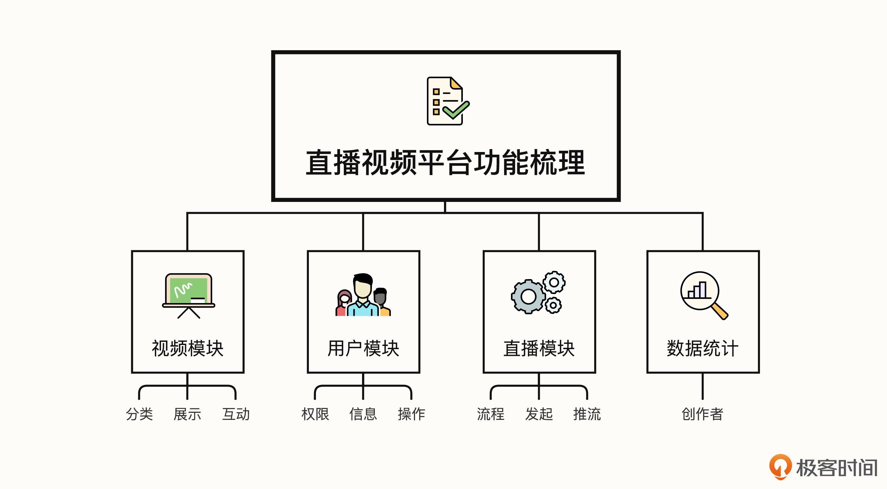

你好，我是悦创。

学习 Python 前后端开发，关键抓手就是项目实践。只有在真实项目中历练，你才能收获最有价值的提升。那什么样的项目适合我们呢？在我看来，项目在精不在多。就拿面试来说，面试官尤其关注的是你是否具备丰富的项目经验，以及对技术的掌握程度。因此，我们要在项目的精度和广度方面下功夫。

为了让你充分锻炼能力，拓宽自己的业务领域，我选择了当下热度非常高的在线视频平台。经历这样一个实操项目，你将接触更多元的功能开发，在工作里更加自如地应对各类项目。无论你是否做过项目开发都不要担心，跟着我的节奏学习，我会带你综合应用前后端技术，增强你的技术硬实力。

在项目实战开始前，这节课我们先来对视频平台进行需求分析和架构设计，规划好我们要实现一个怎样的平台，这是我们项目开发的必经之路。

## 1. 功能架构梳理

只有对平台的需求足够了解，我们后期的开发工作才能顺利展开。我们应该如何设计平台的功能呢？

**第一，我们要规划好平台做多“大”。** 这个大是一个空间单位，我们要考虑哪些功能可以满足用户的核心诉求，能给用户带来什么。

**第二，明确每一个模块我们该做哪些功能。** 项目都是一步步迭代出来的，无法一次性做出一个“顶级”，这不现实，因为你总会遇到一些新的问题和新的需求，这一定是一个不断更新的过程。所以，你可以先考虑小范围地解决模块的基本功能诉求，之后再慢慢迭代升级。

**第三，考虑好各个模块的关联性。** 各个模块是否需要有一些必然联系，能否让用户的体验更好？例如：在视频列表我是否可以直接发起直播？

你会发现这是一个活命题，你的选择有很多。这个问题可以回归到你想满足怎样的用户需求上来评估。所以，我们在前期设计阶段一定要留“口子”，避免之后花更多精力返工、重构，这也是让开发更高效的秘诀。

好，结合这 3 点我们一起来分析一下。

在我看来，视频平台的核心价值包括两个方面。其一，人们可以通过视频快速获取自己需要的内容，这种模式比其他媒介更加高效、便捷、更前沿；其二，视频平台也是用户展示自己的平台，大家都希望可以在平台上展示自己，所以肥沃的流量之地，一定会是必争之地。

我们作为这个平台的设计者，想让平台受到更多的喜爱和推崇，就需要保证平台资源丰富多彩，面向前面说的两方面价值，提供相应的功能支持。

下面是我为你整理好的平台功能模块架构图，结合当下各类视频社区的功能需求，我们要尽可能满足用户对视频平台的需求，这样才更具实用性。在这一部分我们主要考虑功能上的需求，至于技术应用方面，我们会在后面的课程中进行详细讲解，毕竟我们要一起实现这样一个平台，不能光考虑华丽的外表，还要充分重视技术的应用能力。

欢迎关注我公众号：AI悦创，有更多更好玩的等你发现！

::: details 公众号：AI悦创【二维码】

:::

::: info AI悦创·编程一对一

AI悦创·推出辅导班啦，包括「Python 语言辅导班、C++ 辅导班、java 辅导班、算法/数据结构辅导班、少儿编程、pygame 游戏开发」，全部都是一对一教学：一对一辅导 + 一对一答疑 + 布置作业 + 项目实践等。当然，还有线下线上摄影课程、Photoshop、Premiere 一对一教学、QQ、微信在线，随时响应！微信：Jiabcdefh

C++ 信息奥赛题解，长期更新！长期招收一对一中小学信息奥赛集训，莆田、厦门地区有机会线下上门，其他地区线上。微信：Jiabcdefh

方法一：[QQ](http://wpa.qq.com/msgrd?v=3&uin=1432803776&site=qq&menu=yes)

方法二：微信：Jiabcdefh

:::

