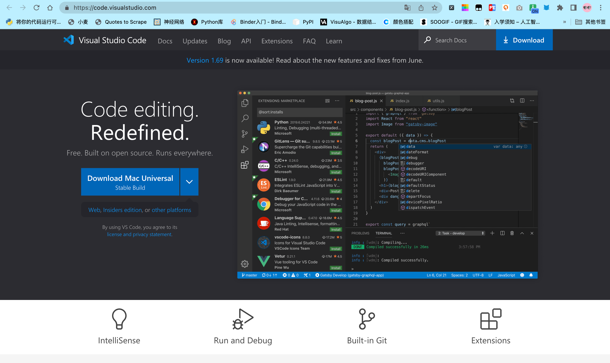
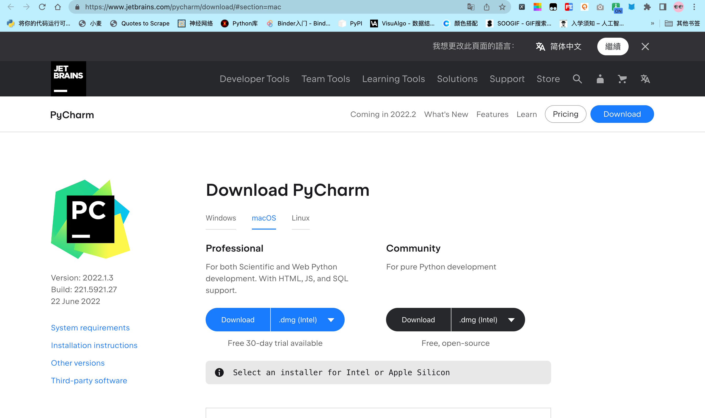

> 人的影响短暂而微弱，书的影响则广泛而深远。——普希金

上节课我带着大家来让 Python 在我们的电脑上安家落户。既然安装成功了，那么使用起来也不是问题。运行 Python 代码有两种方式。一种是直接在 Python 解释器中的输入代码，然后就地执行它（也就是交互模式）。另一种是把 Python 代码保存到文件中，之后去执行这个文件。


## 交互模式执行 Python 代码

先来看下如何在交互模式下执行 Python 代码。首先进入 Python 解释器交互模式，进入方法是：

- 使用 Linux 和 MacOS 的读者在命令行（虚拟终端）中执行命令

```python
python3
```

- 使用 Windows 的读者在命令行（CMD）中执行命令

```python
python
```

之后你会看一些版本和帮助信息：

> ➜ ~ python3 Python 3.7.3 (default, Mar 27 2019, 09:23:15)
> [Clang 10.0.1 (clang-1001.0.46.3)] on darwin
> Type “help”, “copyright”, “credits” or “license” for more information.
> \>>>

这便是 Python 解释器交互模式，上例中左下角的 `>>>` 表示这里是输入代码的地方，此时正在等待你的输入。试着输入一些内容，然后按回车键去执行它：

```python
12345 + 54321
```

> \>>> 12345 + 54321
> 66666

```python
'apple' + 'pen'
```

> \>>> ‘apple’ + ‘pen’
> ‘applepen’

可以看到，按下回车键后解释器会立即执行刚才输入的代码，并直接将执行结果输出出来。

## 执行 Python 文件

再来看下如何执行 Python 文件。所谓 Python 文件，其实就是保存 Python 代码的文件，通常将其文件后缀名约定为 `.py`。

> 扩展：其实用别的后缀名甚至不用后缀名都是可以的，但是既然是约定，那么大家就该遵守。`.py` 后缀能很清晰的表明这是 Python 文件。

我们来创建一个文件，如 `today.py`，然后把以下代码拷贝进去：

```python
import datetime

today = datetime.date.today().strftime('%Y{}%m{}%d{}').format(*'年月日')
print('今天是：' + today)
```

然后通过 Python 命令来执行这个 `today.py` 文件：

- Windows 下执行：

```cmd
python today.py
```

> C:> python today.py
> 今天是：2022年07月17日

- Linux 和 MacOS 下执行：

```python
python3 today.py
```

> ➜ ~ python3 today.py
> 今天是：2022年07月17日

> 注意：上述文件使用的是省略了路径前缀的相对路径形式，执行命令前须先进入到 Python 文件所在目录（即确保工作目录和文件所在目录一致），否则解释器会找不到该文件。也可以直接使用绝对路径的形式，如 `python C:\Users\happy\today.py`，此时无需考虑工作目录。


## 交互模式执行和 Python 文件执行的差别

显而易见，Python 代码的交互模式执行和文件执行在使用形式上是不同的。除此之外，在输出结果的方式上这两种方法也存在一些不同。

比如代码：

```python
12345 + 54321
```

在交互模式下执行时，计算结果会被直接输出出来：

> \>>> 12345 + 54321
> 66666

在这里我们没有使用任何输出操作，代码执行时计算出结果并自动输出。

而如果把这行代码写到文件里（如 `add.py`），然后使用文件执行的方式来执行它，这时命令行中没有任何内容被输出显示。如下：

> ➜ ~ python3 add.py
> ➜ ~

这是因为文件执行时，每个语句的执行结果并不会被自动输出，**除非代码中有明确的输出操作**。

这输出操作具体是什么呢？比如 Python 里有个叫 `print()` 函数的东西，它可以把结果输出显示到命令行中。使用时只需将想要输出的内容放在 `print()` 的括号中，像这样：

```python
print(12345 + 54321)
```

好了，我们修改下文件中的代码，用 `print(12345 + 54321)` 完整替换原来的 `12345 + 54321`，再次执行下看看：

> ➜ ~ python3 add.py
> 66666

这样结果就显示出来了。交互模式下当然也可以使用 `print()`，效果也是一样的。

> 注意：代码中的所有符号，包括括号「()」、逗号「,」、分号「;」等必须使用**英文半角**符号，否则程序会出错。

> 扩展：print() 是 Python 的内置函数（函数概念后续会提到），无需从包（程序库）中导入。准确来讲，它的行为是将内容写到标准输出中。


## 交互模式 or Python 文件？

在做 Python 开发时，大多数时候都是用执行 Python 文件的方式来运行代码。交互模式往往只是在试验小段代码，或者用 Python 做一些简单事情的时候才会去使用。原因是：

- 大多数场景下，我们的程序需要以自动化的方式来运行，而交互模式顾名思义是需要人的参与的，不便于自动化
- 把代码写到文件里方便反复执行
- 交互模式下的输入体验不佳，编写大段代码时不够便利


## 趁手的代码编辑器

执行 Python 文件是运行 Python 代码的主要方式，正因为如此，我们需要一个好用的编辑器来编写 Python 文件，毕竟系统自带的文本编辑器太简陋了。

用来写代码的编辑器实在很多，比如老牌的 VIM、Emacs，之后的 Atom、Sublime，以及新秀 VS code。除此之外，还可以用重量级的 IDE（Integrated Development Environment——集成开发环境）。

> 扩展：编辑器通常有代码编辑、高亮显示、基于历史记录的代码补全等功能。IDE 在编辑器的基础上还支持基于静态分析的代码补全，引用查看，代码跳转，重构，代码格式化，编辑时错误提示，风格提示等强大且常用的功能。
>
> 编辑器能通过插件来扩展得到这些功能，但需要经历一番折腾。想省些力气的读者可以直接用 IDE 来做开发。

这里分别推荐一款代码编辑和一款 IDE：

- VS code，微软开源的优秀代码编辑器。 [官方下载页面](https://code.visualstudio.com/)



- PyCharm。它是 Python 领域口碑和人气双高的 IDE。有付费的个人版本和免费的社区版本，我们使用社区版本就足够了。[官方下载页面](https://www.jetbrains.com/pycharm/download/)



## 本专栏代码演示说明

值得说明的是，后续文章中的代码执行演示以交互模式为主。交互模式的典型标记是 `>>>` 提示符，如下示例就是在解释器交互模式下进行的：

> \>>> 33+725
> 758

另外在代码较长时，本专栏也会使用执行 Python 文件的方式来作代码执行演示。此时的典型标记是 `➜ ~`，表明这是在命令行（即 Windows CMD 或 Llinux / MacOS 虚拟终端）中执行命令。如下：

> ➜ ~ python3 hello.py
> hello

> 说明：上述使用的是 Linux / MacOS 下的 `python3` 命令，使用 Windows 的读者请自行替换为 `python`。

这是本专栏的代码演示形式。读者自己试验代码时，是选择交互模式还是 Python 文件的方式完全由个人喜好而定。如果使用 Python 文件的方式，请不要忘记想要输出执行结果需要在代码里使用 `print()`。

欢迎关注我公众号：AI悦创，有更多更好玩的等你发现！

::: details 公众号：AI悦创【二维码】


:::

::: info AI悦创·编程一对一

AI悦创·推出辅导班啦，包括「Python 语言辅导班、C++ 辅导班、java 辅导班、算法/数据结构辅导班、少儿编程、pygame 游戏开发」，全部都是一对一教学：一对一辅导 + 一对一答疑 + 布置作业 + 项目实践等。当然，还有线下线上摄影课程、Photoshop、Premiere 一对一教学、QQ、微信在线，随时响应！微信：Jiabcdefh

C++ 信息奥赛题解，长期更新！长期招收一对一中小学信息奥赛集训，莆田、厦门地区有机会线下上门，其他地区线上。微信：Jiabcdefh

方法一：[QQ](http://wpa.qq.com/msgrd?v=3&uin=1432803776&site=qq&menu=yes)

方法二：微信：Jiabcdefh

:::


