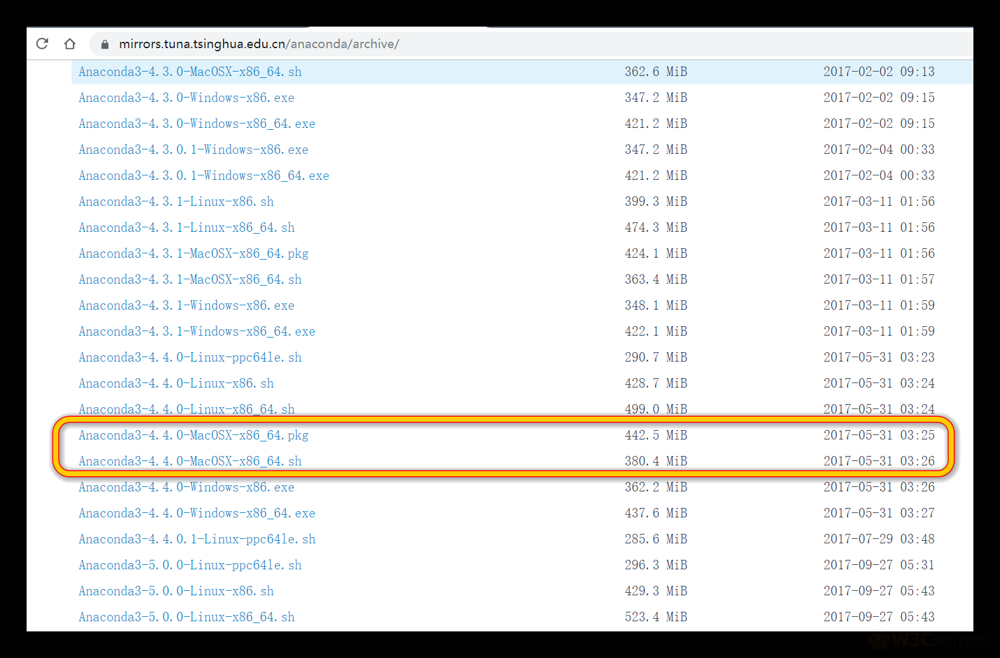
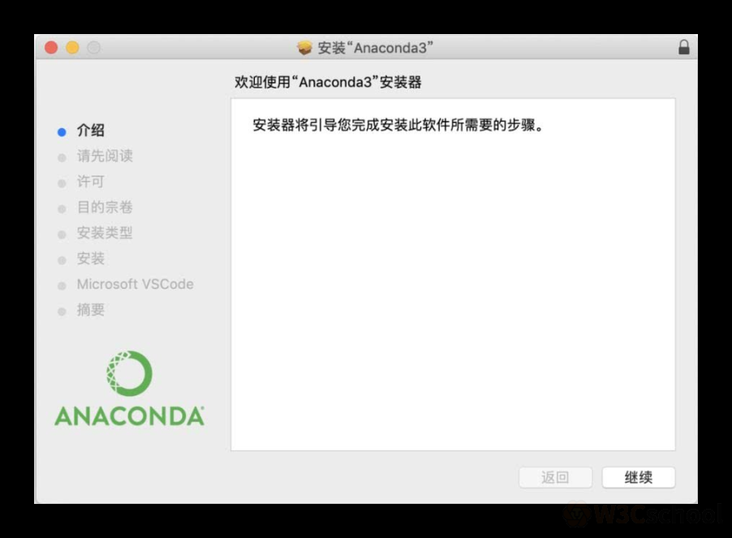
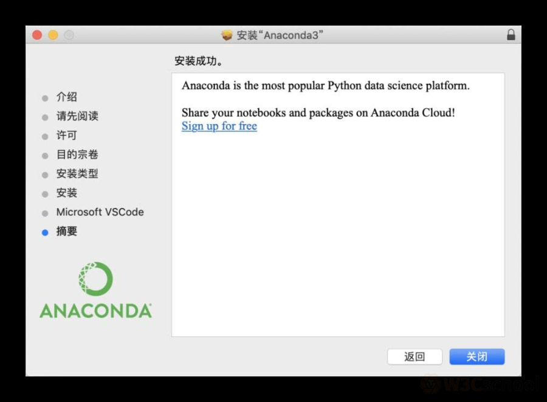
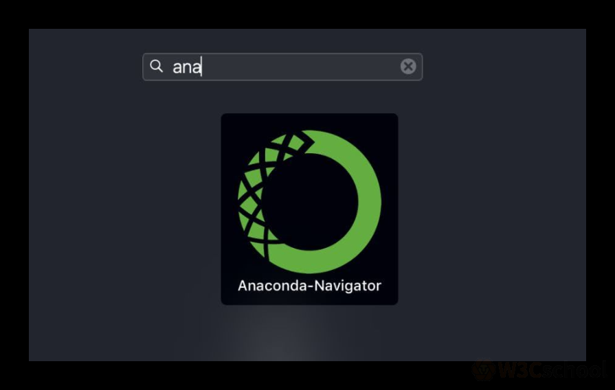

MacOS 基于 Unix，自带 Python2.7 工具。

不过现在都是 Python3 的王道，Python2.7 快要退出舞台了，所以推荐安装 Python3.7 版本。

因为涉及到多个版本的 Python 存在于电脑上，需要区分和使用，所以在此安装的 Python3.7，使用 Anaconda 工具进行安装，自动帮你切换环境问题，非常方便。

（1）先去下载 Anaconda 软件，推荐官网或者清华镜像站，如下图：

推荐的版本是 Anaconda3-4.4.0，MaxOS 有两种格式，一个是 pkg 安装程序，另一个是 sh 代码文件。推荐 pkg 文件，这个是 MacOS 的安装程序格式。

（2）下载好之后，双击安装，会弹出安装提示窗口：

（3）点击继续，跟着提示，同意协议、选择路径、同意安装、安装中、VSCode 选择【可以不要】、安装完成，如下图：

（4）点击关闭，然后在 MacOS 系统中搜索下，就可以看到已经安装好的 Anaconda 程序了，如下图：

（5）安装好之后，打开三个 Terminal 终端，分别输入 conda、python、pip 并回车，这三者应该都有对应的输出，并且 python 的版本你是 3.6。

以上，就是全部的安装细节，下面就可以开始学习课程内容了。

欢迎关注我公众号：AI悦创，有更多更好玩的等你发现！

::: details 公众号：AI悦创【二维码】

:::

::: info AI悦创·编程一对一

AI悦创·推出辅导班啦，包括「Python 语言辅导班、C++ 辅导班、java 辅导班、算法/数据结构辅导班、少儿编程、pygame 游戏开发」，全部都是一对一教学：一对一辅导 + 一对一答疑 + 布置作业 + 项目实践等。当然，还有线下线上摄影课程、Photoshop、Premiere 一对一教学、QQ、微信在线，随时响应！微信：Jiabcdefh

C++ 信息奥赛题解，长期更新！长期招收一对一中小学信息奥赛集训，莆田、厦门地区有机会线下上门，其他地区线上。微信：Jiabcdefh

方法一：[QQ](http://wpa.qq.com/msgrd?v=3&uin=1432803776&site=qq&menu=yes)

方法二：微信：Jiabcdefh

:::

