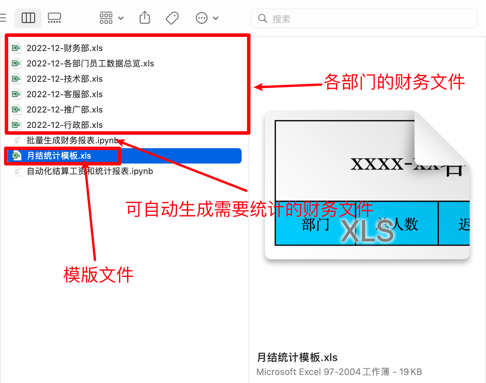
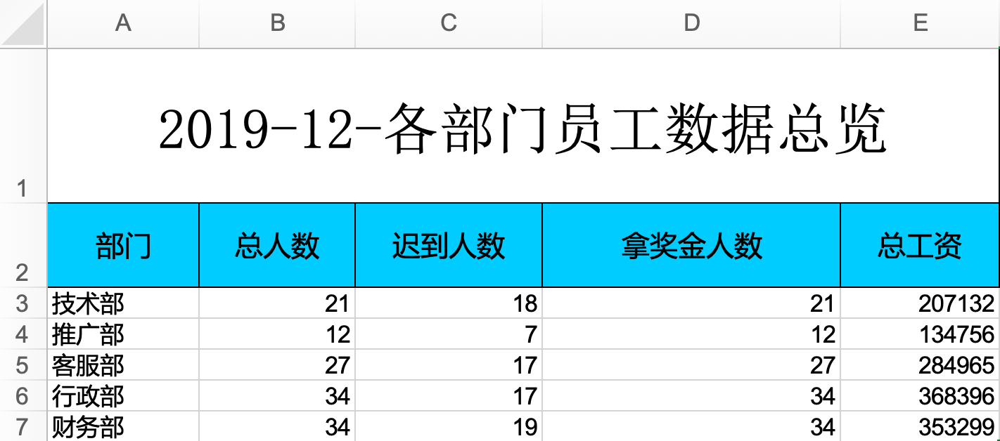
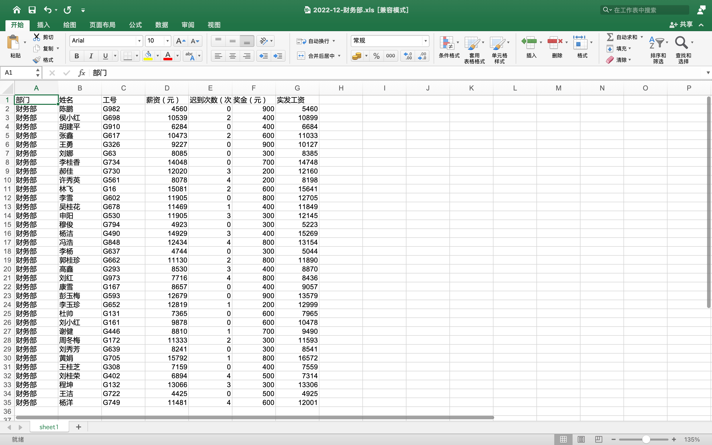
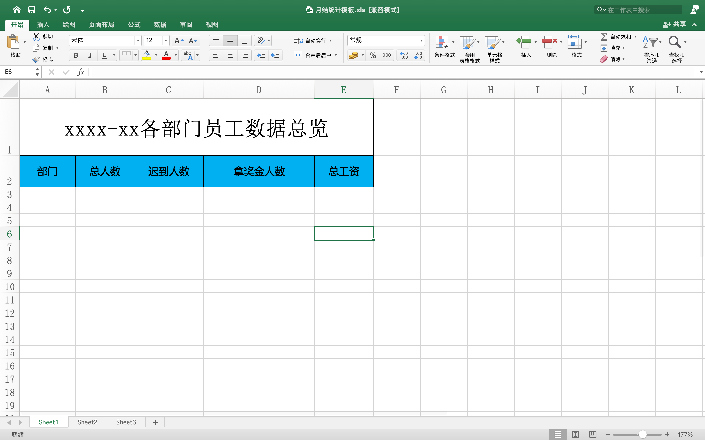
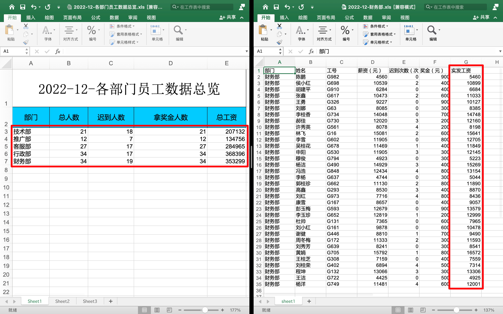

## 实例需求说明

学习了 Excel 文件的写入、读取和追加内容，那现在来做个案例。

需求描述并整理，如下：

- 每个月的 2 号，你会收到一个 Excel 文件；
- 文件中包含了 各个部门的员工信息；
- 你需要一天之内完成这些报表的整理和统计，然后交给领导检查和发放工资；
- 时间要快，工资发晚了，同事会抱怨你；
- 工作量还是比较大的，你需要解放双手，让程序去处理问题
- 让程序快速的计算出每个人的工资，并将统计信息结合模板，生成“`xxxx年xx月各部门员工数据总览`”；
- 薪资计算规定：迟到一次扣 20，一个月最多扣 200；

简单的财务自动化结算需求，并且给出了各部门的工资表格文件和统计报表的模板文件。

## 需求说明图示

简单的财务自动化结算需求，并且给出了各部门的工资表格文件和统计报表的模板文件，截图如下：



## 自行生成各部门所需数据

::: tabs

@tab 2019-12-财务部

| 部门   | 姓名   | 工号 | 薪资（元） | 迟到次数（次） | 奖金（元） | 实发工资 |
| ------ | ------ | ---- | ---------- | -------------- | ---------- | -------- |
| 财务部 | 陈鹏   | G982 | 4560       | 0              | 900        | 5460     |
| 财务部 | 侯小红 | G698 | 10539      | 2              | 400        | 10899    |
| 财务部 | 胡建平 | G910 | 6284       | 0              | 400        | 6684     |
| 财务部 | 张鑫   | G617 | 10473      | 2              | 600        | 11033    |
| 财务部 | 王勇   | G326 | 9227       | 0              | 900        | 10127    |
| 财务部 | 刘娜   | G63  | 8085       | 0              | 300        | 8385     |
| 财务部 | 李桂香 | G734 | 14048      | 0              | 700        | 14748    |
| 财务部 | 郝佳   | G730 | 12020      | 3              | 200        | 12160    |
| 财务部 | 许秀英 | G561 | 8078       | 4              | 200        | 8198     |
| 财务部 | 林飞   | G16  | 15081      | 2              | 600        | 15641    |
| 财务部 | 李雪   | G602 | 11905      | 0              | 800        | 12705    |
| 财务部 | 吴桂花 | G678 | 11469      | 1              | 400        | 11849    |
| 财务部 | 申阳   | G530 | 11905      | 3              | 300        | 12145    |
| 财务部 | 穆俊   | G794 | 4923       | 0              | 300        | 5223     |
| 财务部 | 杨洁   | G490 | 14929      | 3              | 400        | 15269    |
| 财务部 | 冯浩   | G848 | 12434      | 4              | 800        | 13154    |
| 财务部 | 李杨   | G637 | 4744       | 0              | 300        | 5044     |
| 财务部 | 郭桂珍 | G662 | 11130      | 2              | 800        | 11890    |
| 财务部 | 高鑫   | G293 | 8530       | 3              | 400        | 8870     |
| 财务部 | 刘红   | G973 | 7716       | 4              | 800        | 8436     |
| 财务部 | 康雪   | G167 | 8657       | 0              | 400        | 9057     |
| 财务部 | 彭玉梅 | G593 | 12679      | 0              | 900        | 13579    |
| 财务部 | 李玉珍 | G652 | 12819      | 1              | 200        | 12999    |
| 财务部 | 杜帅   | G131 | 7365       | 0              | 600        | 7965     |
| 财务部 | 刘小红 | G161 | 9878       | 0              | 600        | 10478    |
| 财务部 | 谢健   | G446 | 8810       | 1              | 700        | 9490     |
| 财务部 | 周冬梅 | G172 | 11333      | 2              | 300        | 11593    |
| 财务部 | 刘秀芳 | G639 | 8241       | 0              | 300        | 8541     |
| 财务部 | 黄娟   | G705 | 15792      | 1              | 800        | 16572    |
| 财务部 | 王桂芝 | G308 | 7159       | 0              | 400        | 7559     |
| 财务部 | 刘桂荣 | G402 | 6894       | 4              | 500        | 7314     |
| 财务部 | 程坤   | G132 | 13066      | 3              | 300        | 13306    |
| 财务部 | 王洁   | G722 | 4425       | 0              | 500        | 4925     |
| 财务部 | 杨洋   | G749 | 11481      | 4              | 600        | 12001    |

@tab 2019-12-技术部

| 部门   | 姓名   | 工号 | 薪资（元） | 迟到次数（次） | 奖金（元） | 实发工资 |
| ------ | ------ | ---- | ---------- | -------------- | ---------- | -------- |
| 技术部 | 尹淑华 | G886 | 4984       | 4              | 900        | 5804     |
| 技术部 | 唐红霞 | G638 | 14018      | 1              | 200        | 14198    |
| 技术部 | 李杨   | G275 | 6196       | 4              | 400        | 6516     |
| 技术部 | 薛娜   | G929 | 15915      | 0              | 400        | 16315    |
| 技术部 | 齐明   | G757 | 9545       | 1              | 500        | 10025    |
| 技术部 | 郝亮   | G791 | 5280       | 3              | 200        | 5420     |
| 技术部 | 王建国 | G233 | 12745      | 4              | 600        | 13265    |
| 技术部 | 张成   | G877 | 12127      | 3              | 900        | 12967    |
| 技术部 | 叶英   | G770 | 6919       | 0              | 200        | 7119     |
| 技术部 | 邓浩   | G875 | 11583      | 1              | 400        | 11963    |
| 技术部 | 杨雪   | G212 | 5019       | 3              | 200        | 5159     |
| 技术部 | 魏林   | G42  | 6657       | 1              | 600        | 7237     |
| 技术部 | 崔玉   | G909 | 8345       | 2              | 500        | 8805     |
| 技术部 | 黄春梅 | G46  | 13793      | 4              | 900        | 14613    |
| 技术部 | 郁东   | G77  | 14678      | 3              | 600        | 15218    |
| 技术部 | 孙玉   | G803 | 5671       | 3              | 600        | 6211     |
| 技术部 | 宋玉   | G297 | 6212       | 2              | 200        | 6372     |
| 技术部 | 何丽娟 | G182 | 8800       | 0              | 200        | 9000     |
| 技术部 | 张峰   | G949 | 10776      | 1              | 200        | 10956    |
| 技术部 | 孙龙   | G500 | 8871       | 2              | 900        | 9731     |
| 技术部 | 郑龙   | G518 | 9498       | 3              | 800        | 10238    |

@tab 2019-12-客服部

| 部门   | 姓名   | 工号 | 薪资（元） | 迟到次数（次） | 奖金（元） | 实发工资 |
| ------ | ------ | ---- | ---------- | -------------- | ---------- | -------- |
| 客服部 | 杨飞   | G82  | 10511      | 1              | 400        | 10891    |
| 客服部 | 陈海燕 | G923 | 15887      | 0              | 300        | 16187    |
| 客服部 | 郑东   | G137 | 7671       | 0              | 600        | 8271     |
| 客服部 | 俞桂兰 | G689 | 15599      | 4              | 800        | 16319    |
| 客服部 | 李健   | G493 | 9309       | 0              | 700        | 10009    |
| 客服部 | 曾鑫   | G352 | 5758       | 3              | 200        | 5898     |
| 客服部 | 常瑜   | G194 | 7590       | 4              | 900        | 8410     |
| 客服部 | 孙秀珍 | G644 | 4577       | 1              | 700        | 5257     |
| 客服部 | 袁洁   | G231 | 9953       | 1              | 400        | 10333    |
| 客服部 | 任秀英 | G584 | 9994       | 0              | 600        | 10594    |
| 客服部 | 孙畅   | G187 | 5943       | 2              | 900        | 6803     |
| 客服部 | 刘志强 | G690 | 14268      | 4              | 600        | 14788    |
| 客服部 | 庄丹丹 | G401 | 14661      | 3              | 800        | 15401    |
| 客服部 | 陈军   | G499 | 15779      | 3              | 300        | 16019    |
| 客服部 | 张静   | G200 | 7557       | 2              | 400        | 7917     |
| 客服部 | 康红   | G154 | 6392       | 0              | 800        | 7192     |
| 客服部 | 李龙   | G43  | 7717       | 3              | 200        | 7857     |
| 客服部 | 莫凤兰 | G292 | 9502       | 1              | 400        | 9882     |
| 客服部 | 王彬   | G115 | 7964       | 3              | 800        | 8704     |
| 客服部 | 王淑华 | G173 | 13202      | 2              | 900        | 14062    |
| 客服部 | 张秀荣 | G596 | 8798       | 0              | 700        | 9498     |
| 客服部 | 袁鑫   | G754 | 12133      | 2              | 500        | 12593    |
| 客服部 | 胡凤英 | G507 | 10840      | 0              | 900        | 11740    |
| 客服部 | 康秀英 | G390 | 6394       | 2              | 800        | 7154     |
| 客服部 | 汤雷   | G73  | 8497       | 0              | 600        | 9097     |
| 客服部 | 何荣   | G602 | 15601      | 0              | 600        | 16201    |
| 客服部 | 周兰英 | G382 | 7088       | 0              | 800        | 7888     |

@tab 2019-12-推广部

| 部门   | 姓名   | 工号 | 薪资（元） | 迟到次数（次） | 奖金（元） | 实发工资 |
| ------ | ------ | ---- | ---------- | -------------- | ---------- | -------- |
| 推广部 | 王斌   | G486 | 13039      | 4              | 400        | 13359    |
| 推广部 | 郝坤   | G564 | 9125       | 0              | 400        | 9525     |
| 推广部 | 冷林   | G71  | 7697       | 0              | 700        | 8397     |
| 推广部 | 熊华   | G42  | 4806       | 0              | 200        | 5006     |
| 推广部 | 田晶   | G46  | 6480       | 0              | 900        | 7380     |
| 推广部 | 方军   | G206 | 15434      | 2              | 500        | 15894    |
| 推广部 | 来冬梅 | G187 | 5991       | 2              | 700        | 6651     |
| 推广部 | 江雪梅 | G503 | 15770      | 0              | 600        | 16370    |
| 推广部 | 陈艳   | G177 | 15284      | 1              | 300        | 15564    |
| 推广部 | 高玉梅 | G704 | 14255      | 3              | 300        | 14495    |
| 推广部 | 尹红霞 | G933 | 8658       | 4              | 400        | 8978     |
| 推广部 | 魏坤   | G638 | 12497      | 3              | 700        | 13137    |

@tab 2019-12-行政部

| 部门   | 姓名   | 工号 | 薪资（元） | 迟到次数（次） | 奖金（元） | 实发工资 |
| ------ | ------ | ---- | ---------- | -------------- | ---------- | -------- |
| 行政部 | 黄兰英 | G512 | 14617      | 0              | 900        | 15517    |
| 行政部 | 陆勇   | G975 | 8147       | 0              | 900        | 9047     |
| 行政部 | 丁磊   | G380 | 4287       | 3              | 300        | 4527     |
| 行政部 | 刘红霞 | G156 | 15518      | 4              | 500        | 15938    |
| 行政部 | 崔秀芳 | G79  | 8338       | 4              | 600        | 8858     |
| 行政部 | 叶凤兰 | G637 | 6281       | 0              | 500        | 6781     |
| 行政部 | 宿燕   | G238 | 11528      | 1              | 600        | 12108    |
| 行政部 | 傅博   | G42  | 11283      | 0              | 800        | 12083    |
| 行政部 | 殷波   | G653 | 15263      | 4              | 600        | 15783    |
| 行政部 | 张伟   | G995 | 8841       | 2              | 200        | 9001     |
| 行政部 | 莫凯   | G753 | 13487      | 1              | 900        | 14367    |
| 行政部 | 范丽   | G89  | 8098       | 0              | 900        | 8998     |
| 行政部 | 戴桂英 | G394 | 10114      | 2              | 400        | 10474    |
| 行政部 | 刘亮   | G673 | 7130       | 1              | 900        | 8010     |
| 行政部 | 靳淑英 | G308 | 13142      | 0              | 200        | 13342    |
| 行政部 | 王霞   | G331 | 4237       | 0              | 300        | 4537     |
| 行政部 | 彭宇   | G258 | 13499      | 0              | 900        | 14399    |
| 行政部 | 阮凤英 | G730 | 7767       | 0              | 800        | 8567     |
| 行政部 | 唐莹   | G527 | 9214       | 0              | 700        | 9914     |
| 行政部 | 赵倩   | G222 | 13999      | 3              | 400        | 14339    |
| 行政部 | 杜峰   | G117 | 8115       | 0              | 300        | 8415     |
| 行政部 | 华桂英 | G574 | 15404      | 4              | 800        | 16124    |
| 行政部 | 王林   | G29  | 10921      | 0              | 700        | 11621    |
| 行政部 | 温艳   | G721 | 6262       | 1              | 800        | 7042     |
| 行政部 | 吕峰   | G452 | 13348      | 2              | 900        | 14208    |
| 行政部 | 蔡波   | G439 | 4900       | 4              | 700        | 5520     |
| 行政部 | 覃帅   | G393 | 4526       | 0              | 400        | 4926     |
| 行政部 | 王军   | G920 | 11422      | 4              | 400        | 11742    |
| 行政部 | 梁志强 | G399 | 9236       | 1              | 500        | 9716     |
| 行政部 | 王小红 | G779 | 14952      | 0              | 900        | 15852    |
| 行政部 | 粟平   | G671 | 14603      | 0              | 400        | 15003    |
| 行政部 | 刘畅   | G117 | 6265       | 0              | 900        | 7165     |
| 行政部 | 罗红霞 | G465 | 12717      | 0              | 300        | 13017    |
| 行政部 | 盛凯   | G123 | 11215      | 3              | 300        | 11455    |

@tab 2019-12-各部门员工数据总览



| 2019-12-各部门员工数据总览 |        |          |            |        |
| -------------------------- | ------ | -------- | ---------- | ------ |
| 部门                       | 总人数 | 迟到人数 | 拿奖金人数 | 总工资 |
| 技术部                     | 21     | 18       | 21         | 207132 |
| 推广部                     | 12     | 7        | 12         | 134756 |
| 客服部                     | 27     | 17       | 27         | 284965 |
| 行政部                     | 34     | 17       | 34         | 368396 |
| 财务部                     | 34     | 19       | 34         | 353299 |

@tab 月结统计模板


:::

“`批量生成财务报表.ipynb`”这个文件里面有可执行代码，执行后会自动的生成 5 个部门的财务文件。你也可以自己使用下面代码自动生成：

```python
# -*- coding: utf-8 -*-
# @Time    : 2022/7/15 21:48
# @Author  : AI悦创
# @FileName: demo2.py
# @Software: PyCharm
# @Blog    ：http://www.aiyc.top
# @公众号   ：AI悦创
import xlwt
import faker
import random
import datetime


def create_excel_file(filename, department):
    wb = xlwt.Workbook(filename)
    sheet = wb.add_sheet('sheet1')
    fake = faker.Faker("zh_CN")
    head_data = ['部门', '姓名', '工号', '薪资（元）', '迟到次数（次）', '奖金（元）', '实发工资']
    for head in head_data:
        sheet.write(0, head_data.index(head), head)
    for i in range(1, random.randint(5, 100)):
        sheet.write(i, 0, department)
        sheet.write(i, 1, fake.last_name() + fake.first_name())
        sheet.write(i, 2, "G{}".format(random.randint(1, 1000)))
        sheet.write(i, 3, random.randint(4000, 16000))
        sheet.write(i, 4, random.choice([0, 0, 0, 1, 2, 3, 4]))
        sheet.write(i, 5, random.choice([200, 300, 400, 500, 600, 700, 800, 900]))
    wb.save(filename)


department_name = ['技术部', '推广部', '客服部', '行政部', '财务部']
for dep in department_name:
    xls_name = "{}-{}.xls".format(datetime.datetime.now().strftime("%Y-%m"), dep)
    create_excel_file(xls_name, dep)
    print(xls_name, " 新建完成")
```

下面是财务文件和模板文件的截图：





财务文件中，每个用户数据，都是缺少应发工资的，需要用程序计算和填写；

模板文件的使用，需要将本月的部门财务文件全部计算并统计出来，然后填充到模板文件中，生成一个本月的数据总览表格，如下截图：



选中的部分是需要使用程序自动填写。

一共有5个财务文件，每个文件有不固定个数的员工信息。

那接下来就开始写代码，实现自动化工资结算和统计报表的任务。

## 库的导入和准备代码

首先第一步，导入需要的库，生成时间对象。还有就是文件夹中，放着很多文件，有 `xls`、`ipynb` 等格式，所以还需指定要操作的文件名，如下代码：

```python
import datetime
import xlrd, xlwt
from xlutils.copy import copy

department = ['技术部', '推广部', '客服部', '行政部', '财务部']
template_name = "月结统计模板.xls"
today_datetime = datetime.datetime.now()
need_process_xls = []
for dep in department:
    xls_name = "{}-{}.xls".format(datetime.datetime.now().strftime("%Y-%m"), dep)
    need_process_xls.append(xls_name)
print(need_process_xls)
# 输出：['2022-12-技术部.xls', '2022-12-推广部.xls', '2022-12-客服部.xls', '2022-12-行政部.xls', '2022-12-财务部.xls']
```

这里指定了模板文件名，时间对象，然后批量的生成了所需处理的部门财务文件。

## Python 自动化结算工资

每个财务文件都是完全一致的，就是数据的不同，所以接下来，做一个函数，所做的操作就是接收文件名，并计算出文件中全部人员的工资，并写入文件然后保存。代码如下：

```python
def process_xls_return_data(xls_name):
    wb = xlrd.open_workbook(xls_name)
    wb_sheet = wb.sheet_by_index(0)
    xwb = copy(wb)
    xwb_sheet = xwb.get_sheet('sheet1')
    rows = wb_sheet.nrows
    for row in range(1, rows):
        bm = wb_sheet.cell(row, 0).value
        xm = wb_sheet.cell(row, 1).value
        gh = wb_sheet.cell(row, 2).value
        gz = wb_sheet.cell(row, 3).value
        cdcs = wb_sheet.cell(row, 4).value
        jj = wb_sheet.cell(row, 5).value
        sfgz = gz - (cdcs * 20) + jj  # 实发工资 = 工资  -  （迟到次数*20）  +  奖金
        print(bm, xm, gh, gz, cdcs, jj, sfgz)
        xwb_sheet.write(row, 6, sfgz)
        xwb.save(xls_name)


for cls in need_process_xls:
    process_xls_return_data(cls)
```

对函数代码进行介绍：

- 打开文件，打开 sheet，复制文件，读取文件中数据的总行数；
- 从第二行【索引1】开始，读取 部门、姓名、工号、工资、迟到次数、奖金；
- 然后计算应发工资，公式：应该工资 = 工资 - （迟到次数*20） + 奖金；
- 将应该工资写入到当前行的第7个位置【索引6】上；
- 最后保存，保存的文件名依旧是源文件名；
- 完成单个文件的操作；

最下面的 for 循环，就是循环读取要操作的全部财务文件，逐个进入函数中操作，计算工资和保存。

## Python 自动化结算工资+报表统计

自动化的工资结算已经处理好了，下面就是统计各个部门的财务报表。

报表中，需要写入 部门、总人数、迟到人数、拿奖金人数、应发总工资这五项，还有头部的“`xxxx-xx-各部门员工数据总览`”

部门的数据，都是从单个的部门财务文件中获取，例如迟到人数和拿奖金人数，都是判断是否迟到和是否有奖金，都用一个参数进行记录。

这个需求，可以在原来的函数之上，做个统计操作，并在函数结尾时，将这五个数据，做成列表并返回回去。

最后一个就是统计报表的头部字段，里面含有年份和月份，这个可以直接使用时间对象生成即可，但是字体的大小和居中效果是需要额外定义样式 style 的，所以这部分代码比较突兀，大家看懂即可。

如下代码：

```python
def process_xls_return_data(xls_name):
    staff_number = 0  # 总人数字段
    cd_number = 0  # 迟到人数字段
    jj_number = 0  # 拿奖金人数字段
    total_pay = 0  # 总应发工资字段
    wb = xlrd.open_workbook(xls_name, formatting_info=True)
    wb_sheet = wb.sheet_by_index(0)
    xwb = copy(wb)
    xwb_sheet = xwb.get_sheet('sheet1')
    rows = wb_sheet.nrows
    for row in range(1, rows):
        staff_number = staff_number + 1  # 每个数据都是一个员工，直接+1
        bm = wb_sheet.cell(row, 0).value  # 部门名称
        xm = wb_sheet.cell(row, 1).value
        gh = wb_sheet.cell(row, 2).value
        gz = wb_sheet.cell(row, 3).value
        cdcs = wb_sheet.cell(row, 4).value
        if cdcs > 0:  # 如果迟到次数大于0，则是迟到过的人，迟到人数+1
            cd_number = cd_number + 1
        jj = wb_sheet.cell(row, 5).value
        if jj > 0:  # 如果奖金大于0，则是获得了奖金的人，拿奖金人数+1
            jj_number = jj_number + 1
        sfgz = gz - (cdcs * 20) + jj  # 实发工资 = 工资  -  （迟到次数*20）  +  奖金
        total_pay = total_pay + sfgz  # 将所有的实发工资加到一起，就是总的实发工资
        print(bm, xm, gh, gz, cdcs, jj, sfgz)
        xwb_sheet.write(row, 6, sfgz)
    xwb.save(xls_name)
    print([bm, staff_number, cd_number, jj_number, total_pay])
    return [bm, staff_number, cd_number, jj_number, total_pay]  # 最后将部门 总人数  总迟到人数  总拿奖金人数  总实发工资做成列表，一并返回


all_info = []
for cls in need_process_xls:
    one_partment = process_xls_return_data(cls)
    all_info.append(one_partment)  # 将函数的返回值，放到列表中，就得到了所有部门的统计信息

wb = xlrd.open_workbook(template_name, formatting_info=True)
wb_sheet = wb.sheet_by_index(0)
xwb = copy(wb)
xwb_sheet = xwb.get_sheet('Sheet1')
current_row = wb_sheet.nrows
year_month = datetime.datetime.now().strftime("%Y-%m")
title = "{}-各部门员工数据总览"


def create_style():  # 定义字体格式，返回一个字体大小24，垂直居中 水平居中 宋体格式 的样式
    style = xlwt.XFStyle()
    fnt = xlwt.Font()  # 创建一个文本格式，包括字体、字号和颜色样式特性
    fnt.name = u'宋体'
    fnt.height = 20 * 24
    alignment = xlwt.Alignment()
    alignment.horz = 0x02  # 0x01(左端对齐)、0x02(水平方向上居中对齐)、0x03(右端对齐)
    alignment.vert = 0x01  # 0x00(上端对齐)、 0x01(垂直方向上居中对齐)、0x02(底端对齐)
    style.font = fnt
    style.alignment = alignment
    return style


xwb_sheet.write(0, 0, title.format(year_month), create_style())  # 写入头部标题，内容是“xxxx-xx-各部门员工数据总览”，样式是 宋体 大小24 垂直水平居中

for info in all_info:  # 循环所有的部门信息，全部写入到文件中
    xwb_sheet.write(current_row, 0, info[0])
    xwb_sheet.write(current_row, 1, info[1])
    xwb_sheet.write(current_row, 2, info[2])
    xwb_sheet.write(current_row, 3, info[3])
    xwb_sheet.write(current_row, 4, info[4])
    current_row = current_row + 1
xwb.save(title.format(year_month) + '.xls')  # 最后保存，文件名是 xxxx-xx-各部门员工数据总览.xls
```

这个代码是基于上一个函数代码的，多了部门信息统计和基于模板文件生成”`xxxx-xx-各部门员工数据总览.xls`“的统计文件

以上就是本次任务的实现过程。结合代码块1和代码块3，就是完整的代码块。

源码中有文中的全部代码文件，包含“`批量生成财务报表.ipynb`”的代码文件，可以自动生成任意多个部门和任意多个员工的财务文件。

欢迎关注我公众号：AI悦创，有更多更好玩的等你发现！

::: details 公众号：AI悦创【二维码】


:::

::: info AI悦创·编程一对一

AI悦创·推出辅导班啦，包括「Python 语言辅导班、C++ 辅导班、java 辅导班、算法/数据结构辅导班、少儿编程、pygame 游戏开发」，全部都是一对一教学：一对一辅导 + 一对一答疑 + 布置作业 + 项目实践等。当然，还有线下线上摄影课程、Photoshop、Premiere 一对一教学、QQ、微信在线，随时响应！微信：Jiabcdefh

C++ 信息奥赛题解，长期更新！长期招收一对一中小学信息奥赛集训，莆田、厦门地区有机会线下上门，其他地区线上。微信：Jiabcdefh

方法一：[QQ](http://wpa.qq.com/msgrd?v=3&uin=1432803776&site=qq&menu=yes)

方法二：微信：Jiabcdefh

:::


::: details

```python
import xlwt
import xlrd
from xlutils.copy import copy

# 第一步：创建并初始化新的Excel文件，写入初始数据
a = xlwt.Workbook()  # 新建一个workbook对象
sheet = a.add_sheet('sheet1')  # 添加一个sheet
head_data = ['部门', '总人数', '迟到人数', '拿奖金人数', '总工资']
department_name = ['市场部', '技术部', '财务部']

for i, value in enumerate(head_data):
    sheet.write(0, i, value)

for i, value in enumerate(department_name, start=1):
    sheet.write(i, 0, value)

a.save('汇总员工数据.xls')

department_files = ['员工数据5_市场部.xls', '员工数据5_技术部.xls', '员工数据5_财务部.xls']
department_data = []
for file in department_files:
    wb = xlrd.open_workbook(file)
    sheet = wb.sheet_by_index(0)

    kefubu_number = sheet.nrows - 1
    kefulate_number = 0
    jiangjin_number = 0
    salary = 0

    for i in range(1, sheet.nrows):
        if sheet.cell(i, 4).value > 0:
            kefulate_number += 1
        if sheet.cell(i, 5).value > 0:
            jiangjin_number += 1
        salary += sheet.cell(i, 6).value
    department_data.append([kefubu_number, kefulate_number, jiangjin_number, salary])
print(department_data)
a = xlrd.open_workbook('汇总员工数据.xls', formatting_info=True)
xwb = copy(a)
sheet = xwb.get_sheet(0)
for data in department_data:
    sheet.write(department_data.index(data)+1,1,data[0])
    sheet.write(department_data.index(data)+1,2,data[1])
    sheet.write(department_data.index(data)+1,3,data[2])
    sheet.write(department_data.index(data)+1,4,data[3])
xwb.save('汇总员工数据.xls')

```


:::


