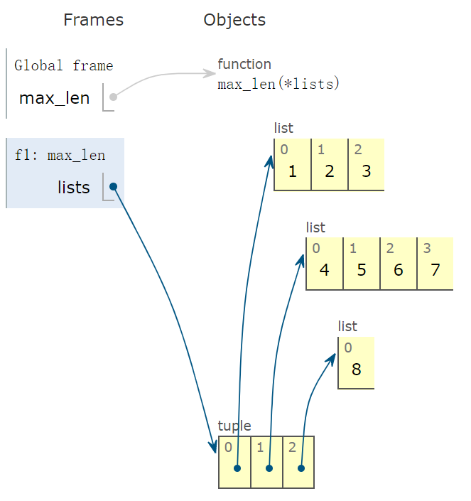
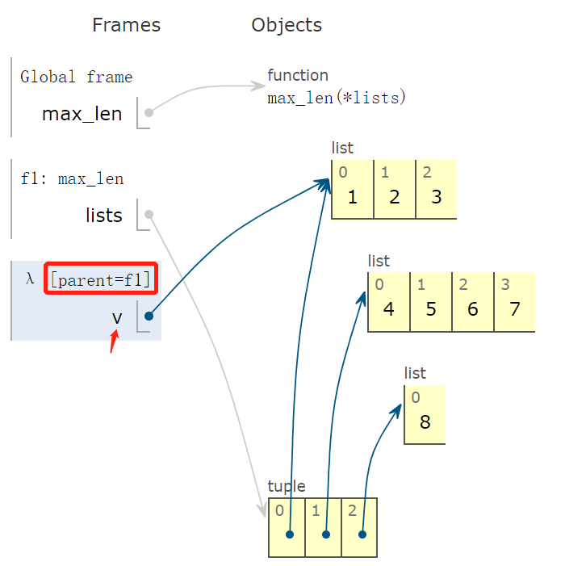
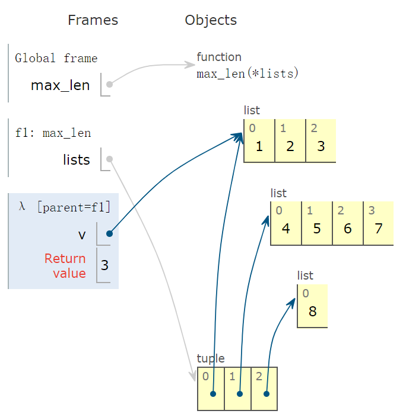
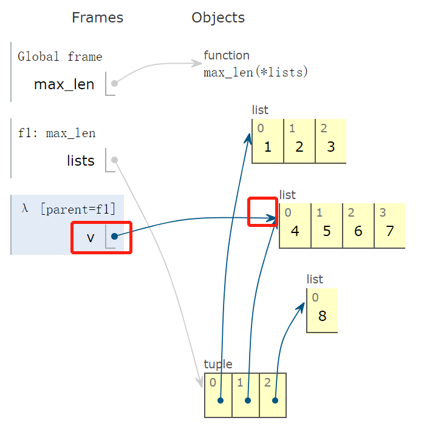
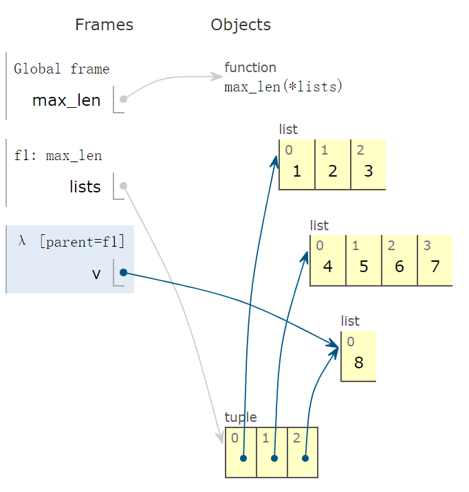
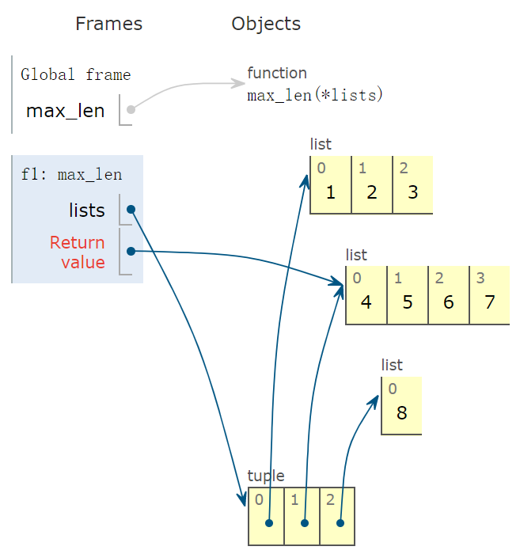
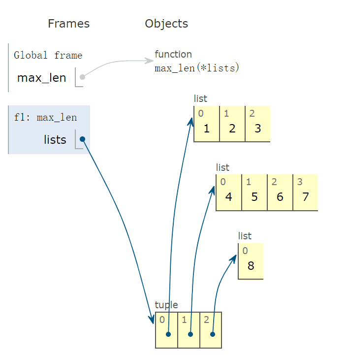
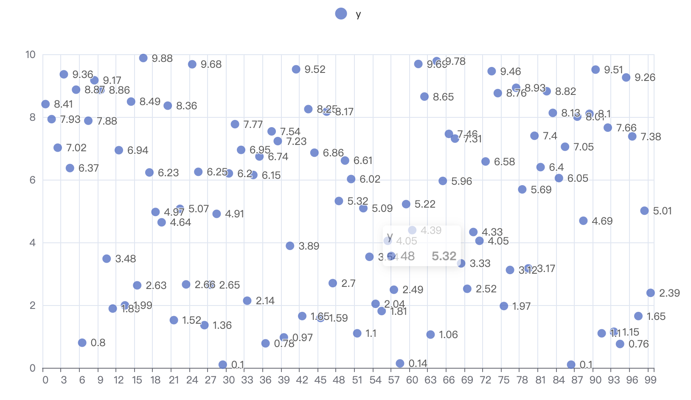

你好，我是悦创。

上一天学习列表和元组的核心知识点，今天趁热打铁，通过 13 个案例，提高对它们的实际运用能力。

大家不妨动手敲起来，真正体会如何使用 Python 中最常用的两个类型：list 和 tuple。

下面个别案例的实现方法，可能未必是最高效的，主要为了有针对性地练习如何使用 list 和 tuple。

## 1. 判断 list 内有无重复元素

`is_duplicated`，使用 list 封装的 count 方法，依次判断每个元素 x 在 list 内的出现次数。

如果大于 1，则立即返回 True，表示有重复。

如果完成遍历后，函数没返回，表明 list 内没有重复元素，返回 False。

```python
In [1]: def is_duplicated(lst):
   ...:     for x in lst:
   ...:         if lst.count(x) > 1: # 判断 x 元素在 lst 中的出现次数

   ...:             return True
   ...:     return False
```

调用 `is_duplicated` 方法：

```python
In [2]: a = [1, -2, 3, 4, 1, 2]
   ...: print(is_duplicated(a))
True
```

以上方法实现不简洁，借助 set 判断更方便：

```python
def is_duplicated(lst):
    return len(lst) != len(set(lst))
```

## 2. 列表反转

一行代码实现列表反转，非常简洁。

- `[::-1]`，这是切片的操作。
- `[::-1]` 生成逆向索引（负号表示逆向），步长为 1 的切片。

所以，最后一个元素一直数到第一个元素。这样，不正好实现列表反转吗？

```python
In [4]: def reverse(lst):
   ...:     return lst[::-1]
```

调用 reverse：

```python
In [5]: r = reverse([1, -2, 3, 4, 1, 2])
   ...: print(r)  
[2, 1, 4, 3, -2, 1]
```

## 3. 找出列表中的所有重复元素

遍历列表，如果出现次数大于 1，且不在返回列表 ret 中，则添加到 ret 中。

满足 `x not in ret`，则表明 x 不在列表中。

```python
In [6]: def find_duplicate(lst):
   ...:     ret = []
   ...:     for x in lst:
   ...:         if lst.count(x) > 1 and x not in ret: # 找到一个新的重复元素
   ...:             ret.append(x)
   ...:     return ret
```

调用 `find_duplicate`：

```python
In [8]: r = find_duplicate([1, 2, 3, 4, 3, 2]
   ...: print(r)
[2, 3]
```

## 4. 斐波那契数列

斐波那契数列第一、二个元素都为 1，第三个元素等于前两个元素和，依次类推。

### 4.1 普通实现版本

```python
In [9]: def fibonacci(n):
   ...:     if n <= 1:
   ...:         return [1]
   ...:     fib = [1, 1]
   ...:     while len(fib) < n:
   ...:         fib.append(fib[len(fib) - 1] + fib[len(fib) - 2])
   ...:     return fib
```

调用 fibonacci：

```python
In [10]: r = fibonacci(5)
    ...: print(r)
[1, 1, 2, 3, 5]
```

这不是高效的实现，使用生成器更节省内存。

### 4.2 生成器版本

使用 Python 的生成器，保证代码简洁的同时，还能节省内存：

```python
In [11]: def fibonacci(n):
    ...:     a, b = 1, 1
    ...:     for _ in range(n):
    ...:         yield a
    ...:         a, b = b, a + b
```

遇到 yield 返回，下次再进入函数体时，从 yield 的下一句开始执行。

```python
In [12]: list(fibonacci(5))
Out[12]: [1, 1, 2, 3, 5] 
```

关于 yield 的详细使用规则，会在后面讲。

## 5. 出镜最多

max 函数是 Python 的内置函数，所以使用它无需 import。

max 有一个 key 参数，指定如何进行值得比较。

下面案例，求出现频次最多的元素：

```python
In [13]: def mode(lst):
             if not lst: 
                return None
    ...:     return max(lst, key=lambda v: lst.count(v)) # v 在 lst 的出现次数作为大小比较的依据
```

调用 mode：

```python
In [14]: lst = [1, 3, 3, 2, 1, 1, 2]
    ...: r = mode(lst)
    ...: print(f'{lst} 中出现次数最多的元素为:{r}')
[1, 3, 3, 2, 1, 1, 2]中出现次数最多的元素为:1
```

出镜最多的元素有多个时，按照以上方法，默认只返回一个。

下面，支持返回多个：

```python
In [34]: def mode(lst):
    ...:     if not lst:
    ...:         return None
    ...:     max_freq_elem = max(lst, key=lambda v: lst.count(v))
    ...:     max_freq = lst.count(max_freq_elem) # 出现最多次数
    ...:     ret = []
    ...:     for i in lst:
    ...:         if i not in ret and lst.count(i)==max_freq:
    ...:             ret.append(i)
    ...:     return ret

In [35]: mode([1,1,2,2,3,2,1])
Out[35]: [1, 2]
```

## 6. 更长列表

带有一个 `*` 的参数为可变的位置参数，意味着能传入任意多个位置参数。

key 函数定义怎么比较大小：lambda 的参数 v 是 lists 中的一个元素。

```python
In [15]: def max_len(*lists):
    ...:     return max(*lists, key=lambda v: len(v)) # v 代表一个 list，其长度作为大小比较的依据
```

调用 `max_len`，传入三个列表，正是 v 可能的三个取值。

```python
In [17]: r = max_len([1, 2, 3], [4, 5, 6, 7], [8])
    ...: print(f' 更长的列表是 {r}')
更长的列表是 [4, 5, 6, 7]
```

关于 lambda 函数，在此做图形演示。

`max_len` 函数被传入三个实参，类型为 list，如下图所示，lists 变量指向最下面的 tuple 实例。



程序运行到下一帧，会出现 lambda 函数，它的父函数为 f1，也就是 `max_len` 函数。

有些读者可能不理解两点，这种用法中：

- 参数 v 取值到底是多少？
- lambda 函数有返回值吗？如果有，返回值是多少？

通过下面图形，非常容易看出，v 指向 tuple 实例的第一个元素，指向的线和箭头能非常直观地反映出来。




下面示意图中，看到返回值为 3，也就是 `len(v)` 的返回值，其中 `v = [1,2,3]`。




然后，v 指向 tuple 中的下一个元素，返回值为 4。



然后，v 指向 tuple 的最后一个元素 `[8]`，返回值为 1。



根据 key 确定的比较标准，max 函数的返回值为红色字体指向的元素，也就是返回 `[4,5,6,7]`。



完整动画演示：



## 7. 求表头

返回列表的第一个元素，注意列表为空时，返回 None。

通过此例，学会使用 if 和 else 的这种简洁表达。

```python
In [18]: def head(lst):
    ...:     return lst[0] if len(lst) > 0 else None
```

调用 head：

```python
In [19]: print(head([]))
    ...: print(head([3, 4, 1]))
None
3
```

## 8. 求表尾

求列表的最后一个元素，同样列表为空时，返回 None。

```python
In [20]: def tail(lst):
    ...:     return lst[-1] if len(lst) > 0 else None
```

调用 tail：

```python
In [21]: print(tail([]))
    ...: print(tail([3, 4, 1]))
None
1
```

## 9. 打印乘法表

外层循环一次，`print()`，换行；内层循环一次，打印一个等式。

```python
In [26]: def mul_table():
    ...:     for i in range(1, 10):
    ...:         for j in range(1, i + 1):
    ...:             print(str(j) + str("*") + str(i)+"=" + str(i*j), end="\t")
    ...:         print() # 打印一个换行
```

调用 `mul_table`：

```python
In [27]: mul_table()
1*1=1
1*2=2   2*2=4
1*3=3   2*3=6   3*3=9
1*4=4   2*4=8   3*4=12  4*4=16
1*5=5   2*5=10  3*5=15  4*5=20  5*5=25
1*6=6   2*6=12  3*6=18  4*6=24  5*6=30  6*6=36
1*7=7   2*7=14  3*7=21  4*7=28  5*7=35  6*7=42  7*7=49
1*8=8   2*8=16  3*8=24  4*8=32  5*8=40  6*8=48  7*8=56  8*8=64
1*9=9   2*9=18  3*9=27  4*9=36  5*9=45  6*9=54  7*9=63  8*9=72  9*9=81
```

## 10. 元素对

- `t[:-1]`：原列表切掉最后一个元素；
- `t[1:]`：原列表切掉第一个元素；
- `zip(iter1, iter2)`：实现 iter1 和 iter2 的对应索引处的元素拼接。

```python
In [32]: list(zip([1,2],[2,3]))
Out[32]: [(1, 2), (2, 3)]
```

理解上面，元素组对的实现就不难理解：

```python
In [28]: def pair(t):
    ...:     return list(zip(t[:-1],t[1:])) # 生成相邻元素对
```

调用 pair：

```python
In [29]: pair([1,2,3])
Out[29]: [(1, 2), (2, 3)]

In [30]: pair(range(10))
Out[30]: [(0, 1), (1, 2), (2, 3), (3, 4), (4, 5), (5, 6), (6, 7), (7, 8), (8, 9)]
```

## 11. 样本抽样

内置 random 模块中，有一个 sample 函数，实现“抽样”功能。

下面例子从 100 个样本中，随机抽样 10 个。

- 首先，使用列表生成式，创建长度为 100 的列表 lst；
- 然后，sample 抽样 10 个样本。

```python
In [33]: from random import randint,sample
    ...: lst = [randint(0,50) for _ in range(100)] # randint 生成随机整数；
    ...: print(lst[:5])
    ...: lst_sample = sample(lst,10) # sample 从 lst 中抽样 10 个元素
    ...: print(lst_sample)
[0, 38, 31, 33, 43]
[9, 43, 31, 22, 31, 30, 14, 47, 14, 1]
```

## 12. 重洗数据集

内置 random 中的 shuffle 函数，能冲洗数据。

值得注意，shuffle 是对输入列表就地（in place）洗牌，节省存储空间。

```python
In [34]: from random import shuffle
    ...: lst = [randint(0,50) for _ in range(100)]
    ...: shuffle(lst) # 重洗数据
    ...: print(lst[:5]) 
[22, 49, 34, 9, 38]
```

## 13. 生成满足均匀分布的坐标点

random 模块，`uniform(a,b)` 生成 `[a,b)` 内的一个随机数。

如下，借助列表生成式，生成 100 个均匀分布的坐标点。

```python
from random import uniform

x, y = [i for i in range(100)], [
    round(uniform(0, 10), 2) for _ in range(100)]
print(y)


# 输出
[9.78, 4.44, 0.38, 9.22, 3.36, 4.77, 0.24, 5.41, 6.93, 1.58, 5.26, 5.75, 0.44, 7.62, 4.85, 3.59, 2.67, 5.41, 6.22, 9.66, 2.51, 8.69, 6.89, 7.22, 8.55, 2.8, 2.84, 4.44, 6.33, 8.8, 6.31, 0.12, 9.54, 6.43, 9.17, 3.56, 3.75, 0.56, 2.39, 9.98, 4.87, 2.32, 0.3, 1.67, 8.7, 5.48, 3.0, 2.01, 5.32, 8.62, 7.22, 1.04, 6.02, 6.52, 0.01, 1.14, 2.27, 2.17, 8.41, 7.75, 6.49, 1.42, 8.18, 2.56, 9.96, 3.5, 0.61, 7.07, 9.22, 4.41, 8.39, 8.63, 7.02, 9.96, 0.4, 0.34, 6.42, 2.1, 1.3, 0.29, 3.24, 0.02, 4.9, 7.72, 7.07, 1.64, 1.44, 9.62, 9.6, 6.38, 8.31, 0.91, 5.13, 1.1, 7.16, 3.73, 5.83, 9.95, 0.26, 3.01]
```

使用 PyEcharts 绘图，版本 `1.6.2`。

注意，运行以下代码至少保证版本要在 `1.0` 以上：

```python
from pyecharts.charts import Scatter
import pyecharts.options as opts
from random import uniform


def draw_uniform_points():
    x, y = [i for i in range(100)], [
        round(uniform(0, 10), 2) for _ in range(100)]
    print(y)
    c = (
        Scatter()
        .add_xaxis(x)
        .add_yaxis('y', y)
    )
    c.render()


draw_uniform_points()
```

得到结果如下，变量 y 取值满足均匀分布。

执行程序，会在 py 文件所在目录生成一个 HTML 文件，打开会查看到下图。



## 14. 小结

今天与大家一起学习 13 个使用列表和元组的案例。

涉及到切片操作、key 函数、zip 连接等 Python 中最常用的知识点。

希望大家手动敲敲代码，找找 Python 编码的乐趣，为后面的学习打下坚实的基础。


<VidStack src="/video/Python60Days/Day4.mp4" />


## 15. 分享交流

我为本专栏付费读者创建了微信交流群，以方便更有针对性地讨论专栏相关的问题。入群方式请添加 AI悦创的微信号：Jiabcdefh（或扫描以下二维码），然后给我发「Python60」消息，即可拉你进群～


欢迎关注我公众号：AI悦创，有更多更好玩的等你发现！

::: details 公众号：AI悦创【二维码】


:::

::: info AI悦创·编程一对一

AI悦创·推出辅导班啦，包括「Python 语言辅导班、C++ 辅导班、java 辅导班、算法/数据结构辅导班、少儿编程、pygame 游戏开发」，全部都是一对一教学：一对一辅导 + 一对一答疑 + 布置作业 + 项目实践等。当然，还有线下线上摄影课程、Photoshop、Premiere 一对一教学、QQ、微信在线，随时响应！微信：Jiabcdefh

C++ 信息奥赛题解，长期更新！长期招收一对一中小学信息奥赛集训，莆田、厦门地区有机会线下上门，其他地区线上。微信：Jiabcdefh

方法一：[QQ](http://wpa.qq.com/msgrd?v=3&uin=1432803776&site=qq&menu=yes)

方法二：微信：Jiabcdefh

:::

