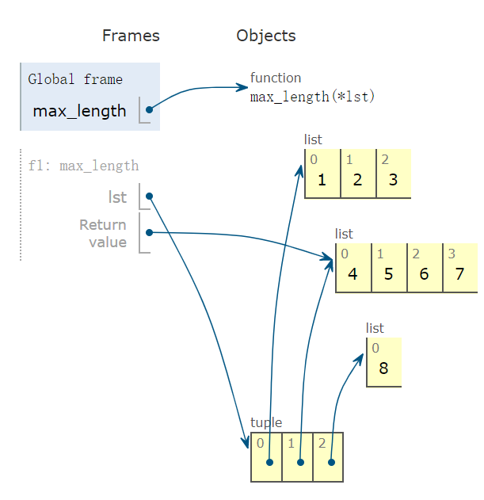

你好，我是悦创。

## 1. 学习函数原型

有些朋友平时反映，看不懂官方文档中介绍函数的说明，比如：

```python
max(iterable,*[, key, default])
```

max 函数的几个形参，为什么有 `*` 符号，又有 `[]`？

今天在总结内置函数前，先看下如何理解函数原型的文档。

函数形参列表中符号 `*` 表示，后面的形参只能为关键字参数（keyword argument），不能为位置参数（positional argument），也就是说，max 函数要这么用：

```python
In [5]: a = [1, 2, 3, 4, 2, 2, 3]

In [6]: max(a, key=lambda x: a.count(x), default=1)
Out[6]: 2
```

定义函数 f，参数 b 位于 `*` 后面，只能为关键字参数：

```python
In [116]: def f(a, *, b):
     ...:     pass

In [117]: f(a, b=1)

In [118]: f(a, 1) # 这种调用是错误的
TypeError: f() takes 1 positional argument but 2 were given
```

再看一个内置函数 sum：

```python
sum(iterable, /, start=0)
```

看到形参列表中有一个 `/`，它表示 `/` 前的参数只能是位置参数，不能是关键字参数。

因此，以下调用是合法的：

```python
In [18]: a = [1, 3, 2, 1, 4, 2]

In [19]: sum(a,2) # start=2 表示求和的初始值为 2
Out[19]: 15
```

以下调用是非法的，iterable 参数不能被赋值为关键字实参：

```python
In [23]: sum(iterable=a,start=2)

TypeError: sum() takes no keyword arguments
```

平时大家更多看到的是这么使用 max 函数：

```python
In [7]: max([1, 2, 3, 4, 2, 2, 3])
Out[7]: 4
```

`[]` 表示里面的形参是可选项，max 函数可被如下几种形式调用：

```python
max(iterable)
max(iterable,*, key)
max(iterable,*,default)
max(iterable,*, key, default)
```

不能这么被调用：

```python
max(*, key)
```

iterable 没有默认值，所以它是不能被省略的，必须要给出一个实参。

关于 Python 中五类函数参数，也会单独有介绍。

在弄懂这些基础知识后，下面开始总结内置函数的用法，同时学会 Python 中函数如何定义、如何使用等。

## 2. 数学运算

### 2.1 len(s)

返回对象内元素个数：

```python
In [83]: dic = {'a': 1, 'b': 3}
In [84]: len(dic)
Out[84]: 2
```

### 2.2 max(iterable, *[, default=obj, key=func])

`max(iterable, *[, default=obj, key=func])`，返回最大值：

```python
In [99]: max(3, 1, 4, 2, 1)
Out[99]: 4

In [100]: max((), default=0)
Out[100]: 0

In [89]: di = {'a': 3, 'b1': 1, 'c': 4}
In [90]: max(di)
Out[90]: 'c'

In [102]: a = [{'name': 'xiaoming', 'age': 18, 'gender': 'male'}, {'name': '
     ...: xiaohong', 'age': 20, 'gender': 'female'}]
In [104]: max(a, key=lambda x: x['age'])
Out[104]: {'name': 'xiaohong', 'age': 20, 'gender': 'female'}
```

如果已知多个列表，找出列表更长的，使用 max 方法：

```python
In [12]: def max_length(*lst):
    ...:     return max(*lst, key=lambda v: len(v))

In [13]: max_length([1, 2, 3], [4, 5, 6, 7], [8])
Out[13]: [4, 5, 6, 7]
```

代码可视化图：



可看到，max、min 函数都有一个参数 key，它们也被称为 key 函数，key 函数一般结合更紧凑的 lambda 函数。

max 有一个 default 参数：

- 当传入的列表为空时，若参数 default 被赋值，则返回 default；
- 否则，会抛空序列的异常（empty sequence）。

```python
In [4]: max([], default='0')
Out[4]: '0'

In [5]: max([])
ValueError: max() arg is an empty sequence
```

### 2.3 pow(base, exp, mod=None)

base 为底的 exp 次幂，如果 mod 给出，取余：

```python
In [149]: pow(3, 2, 4)
Out[149]: 1
```

### 2.4 round(number, ndigits=None)

四舍五入，ndigits 代表小数点后保留几位：

```python
In [157]: round(10.0222222, 3)
Out[157]: 10.022
```

### 2.5 sum(iterable, /, start=0)

求和：

```python
In [181]: a = [1, 4, 2, 3, 1]

In [182]: sum(a)
Out[182]: 11

In [185]: sum(a, 10) #求和的初始值为10
Out[185]: 21
```

### 2.6 abs(x, /)

求绝对值或复数的模：

```python
In [1]: abs(-6)
Out[1]: 6
```

### 2.7 divmod(a, b)

分别取商和余数：

```python
In [97]: divmod(10, 3)
Out[97]: (3, 1)
```

### 2.8 complex(real=0, imag=0)

创建一个复数：

```python
In [81]: complex(1, 2)
Out[81]: (1+2j)
```

### 2.9 hash(obj, /)

返回对象的哈希值：

```python
In [30]: class Student():
    ...:     def __init__(self,id,name):
    ...:         self.id = id
    ...:         self.name = name
    ...:     def __repr__(self):
    ...:         return 'id = '+self.id +', name = '+self.name

In [33]: xiaoming = Student('001','xiaoming')
In [112]: hash(xiaoming)
Out[112]: 6139638
```

### 2.10 id(obj, /)

返回对象的内存地址：

```python
In [30]: class Student():
    ...:     def __init__(self,id,name):
    ...:         self.id = id
    ...:         self.name = name
    ...:     def __repr__(self):
    ...:         return 'id = '+self.id +', name = '+self.name

In [33]: xiaoming = Student('001','xiaoming')
In [115]: id(xiaoming)
Out[115]: 98234208
```

## 3. 逻辑运算

### 3.1 all(iterable, /)

接受一个迭代器，如果迭代器的所有元素都为真，返回 True，否则返回 False：

```python
In [2]: all([1, 0, 3, 6])
Out[2]: False

In [3]: all([1, 2, 3])
Out[3]: True
```

### 3.2 any(iterable, /)

接受一个迭代器，如果迭代器里有一个元素为真，返回 True，否则返回 False：

```python
In [4]: any([0, 0, 0, []])
Out[4]: False

In [5]: any([0, 0, 1])
Out[5]: True
```

## 4. 进制转化

### 4.1 ascii(obj, /)

调用对象的 `repr()` 方法，获得该方法的返回值。

```python
In [30]: class Student():
    ...:     def __init__(self,id,name):
    ...:         self.id = id
    ...:         self.name = name
    ...:     def __repr__(self):
    ...:         return 'id = '+self.id +', name = '+self.name

In [33]: xiaoming = Student('001','xiaoming')
In [34]: print(xiaoming)
id = 001, name = xiaoming

In [34]: ascii(xiaoming)
Out[34]: 'id = 001, name = xiaoming'
```

### 4.2 bin(number, /)

将十进制转换为二进制：

```python
In [35]: bin(10)
Out[35]: '0b1010'
```

### 4.3 oct(number, /)

将十进制转换为八进制：

```python
In [36]: oct(9)
Out[36]: '0o11'
```

### 4.4 hex(number, /)

将十进制转换为十六进制：

```python
In [37]: hex(15)
Out[37]: '0xf'
```

## 5. 小结

今天与大家一起学习，如何查看函数原型文档，同时学习 16 个数学、逻辑、进制转化相关的内置函数：

- 10 个和数学运算相关；
- 2 个逻辑运算相关；
- 4 个进制转化相关的。

使用它们不用 import，处处可用，很方便。

<VidStack src="/video/Python60Days/Day7.mp4" />


欢迎关注我公众号：AI悦创，有更多更好玩的等你发现！

::: details 公众号：AI悦创【二维码】


:::

::: info AI悦创·编程一对一

AI悦创·推出辅导班啦，包括「Python 语言辅导班、C++ 辅导班、java 辅导班、算法/数据结构辅导班、少儿编程、pygame 游戏开发」，全部都是一对一教学：一对一辅导 + 一对一答疑 + 布置作业 + 项目实践等。当然，还有线下线上摄影课程、Photoshop、Premiere 一对一教学、QQ、微信在线，随时响应！微信：Jiabcdefh

C++ 信息奥赛题解，长期更新！长期招收一对一中小学信息奥赛集训，莆田、厦门地区有机会线下上门，其他地区线上。微信：Jiabcdefh

方法一：[QQ](http://wpa.qq.com/msgrd?v=3&uin=1432803776&site=qq&menu=yes)

方法二：微信：Jiabcdefh

:::

