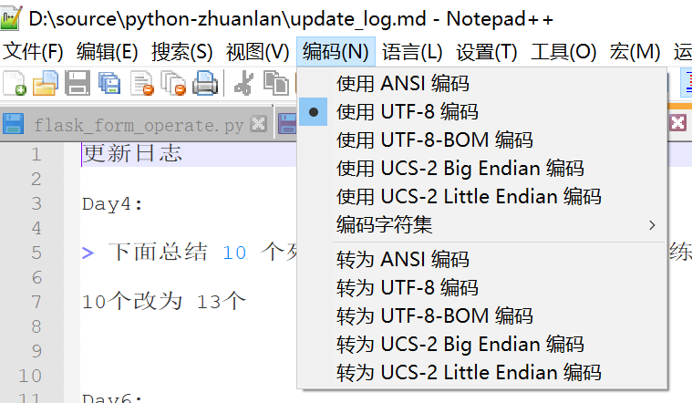

你好，我是悦创。

Python 文件 IO 操作：

- 涉及文件读写操作
- 获取文件后缀名
- 批量修改后缀名
- 获取文件修改时间
- 压缩文件
- 加密文件等常用操作

## 1. 文件读操作

文件读、写操作比较常见。读取文件，要先判断文件是否存在。

- 若文件存在，再读取；
- 不存在，抛出文件不存在异常。

```python
In [8]: import os

In [9]: def read_file(filename):
   ...:     if os.path.exists(filename) is False:
   ...:         raise FileNotFoundError('%s not exists'%(filename,))
   ...:     f = open(filename)
   ...:     content = f.read()
   ...:     f.close()
   ...:     return content
```

试着读取一个 D 盘文件：

```python
In [13]: read_file('D:/source/python-zhuanlan/update_log.md')
---------------------------------------------------------------------------
UnicodeDecodeError                        Traceback (most recent call last)
<ipython-input-13-92e8f4011b20> in <module>
----> 1 read_file('D:/source/python-zhuanlan/update_log.md')

<ipython-input-12-5591c3ba7b42> in read_file(filename)
      3         raise FileNotFoundError('%s not exists'%(filename,))
      4     f = open(filename)
----> 5     content = f.read()
      6     f.close()
      7     return content

UnicodeDecodeError: 'gbk' codec can't decode byte 0xaa in position 46: illegal multibyte sequence
```

出错！在 `f.read` 这行，有错误提示看，是编码问题。open 函数打开文件，默认编码格式与平台系统有关，鉴于此，有必要在 open 时为参数 encoding 赋值，一般采用 `UTF-8`：

```python
In [9]: def read_file(filename):
   ...:     if os.path.exists(filename) is False:
   ...:         raise FileNotFoundError('%s not exists'%(filename,))
   ...:     f = open(filename,encoding='utf-8')
   ...:     content = f.read()
   ...:     f.close()
   ...:     return content
```

代码打开文件的编码确认为 UTF-8 后，还需要确认，磁盘中这个文件编码格式也为 UTF-8。推荐使用 Notepad++ 查看文件编码格式，查看方式如下图所示：



下面，读入成功：

```python
In [22]: read_file('D:/source/python-zhuanlan/update_log.md')
Out[22]: '更新日志\n\nDay4: \n\n> 下面总结 10 个列表和元祖使用的经典例子，通过练习，进一步加深对它们提供的方法的理解。\n\n10 个改为 13 个 \n\n\n\nDay6:\n\n 第 12 个，13 个间有多余的空行
```

上面，还提到 open 后，务必要 close，这种写法有些繁琐，还容易出错。借助 with 语法，同时实现 open 和 close 功能，这是更常用的方法。

```python
In [9]: def read_file(filename):
   ...:     if os.path.exists(filename) is False:
   ...:         raise FileNotFoundError('%s not exists'%(filename,))
   ...:     with open(filename,encoding='utf-8') as f :
                content = f.read()
   ...:     return content
```

## 2. 文件按行读

read 函数一次读取整个文件，readlines 函数按行一次读取整个文件。读入文件小时，使用它们没有问题。

但是，如果读入文件大，read 或 readlines 一次读取整个文件，内存就会面临重大挑战。

使用 readline 一次读取文件一行，能解决大文件读取内存溢出问题。

文件 `a.txt` 内容如下：

```
Hey, Python

I just love      Python so much,
and want to get the whole  Python stack by this 60-days column
and believe Python !
```

如下，读取文件 `a.txt`，`r+` 表示读写模式。代码块实现：

- 每次读入一行。
- 选择正则 split 分词，注意观察 `a.txt`，单词间有的一个空格，有的多个。这些情况，实际工作中确实也会遇到。
- 使用 defaultdict 统计单词出现频次。
- 按照频次从大到小降序。

```python
In [38]: from collections import defaultdict
    ...: import re
    ...:
    ...: rec = re.compile('\s+')
    ...: dd = defaultdict(int)
    ...: with open('a.txt','r+') as f:
            for line in f:
    ...:        clean_line = line.strip()
    ...:        if clean_line:
    ...:           words = rec.split(clean_line)
    ...:           for word in words:
    ...:               dd[word] += 1
    ...: dd = sorted(dd.items(),key=lambda x: x[1],reverse=True)
    ...: print('---print stat---')
    ...: print(dd)
    ...: print('---words stat done---')
```

程序运行结果：

```python
Hey, Python


I just love      Python so much,

and want to get the whole  Python stack by this 60-days column

and believe Python !
---print stat---
[('Python', 3), ('and', 2), ('I', 1), ('just', 1), ('love', 1), ('so', 1), ('much,', 1), ('want', 1), ('to', 1), ('get', 1), ('the', 1), ('whole', 1), ('stack', 1), ('by', 1), ('this', 1), ('60-days', 1), ('column', 1), ('believe', 1), ('!', 1)]
---words stat done---
```

## 3. 文件写操作

文件写操作时，需要首先判断要写入的文件路径是否存在。

若不存在，通过 mkdir 创建出路径；否则，直接写入文件：

```python
import os


def write_to_file(file_path,file_name):
    if os.path.exists(file_path) is False:
        os.mkdir(file_path)

    whole_path_filename = os.path.join(file_path,file_name)
    to_write_content = ''' 
                        Hey, Python
                        I just love Python so much,
                        and want to get the whole python stack by this 60-days column
                        and believe!
                        '''
    with open(whole_path_filename, mode="w", encoding='utf-8') as f:
        f.write(to_write_content)
    print('-------write done--------')

    print('-------begin reading------')
    with open(whole_path_filename,encoding='utf-8') as f:
        content = f.read()
        print(content)
        if to_write_content == content:
            print('content is equal by reading and writing')
        else:
            print('----Warning: NO Equal-----------------')
```

以上这段代码思路：

- 路径不存在，创建路径
- 写文件
- 读取同一文件
- 验证写入到文件的内容是否正确

打印出的结果：

```python
-------begin writing-------
-------write done--------
-------begin reading------

                        Hey, Python
                        I just love Python so much,
                        and want to get the whole python stack by this 60-days column
                        and believe!

content is equal by reading and writing
```

## 4. 获取文件名

有时拿到一个文件名时，名字带有路径。这时，使用 `os.path`、split 方法实现路径和文件的分离。

```python
In [11]: import os
    ...: file_ext = os.path.split('./data/py/test.py')
    ...: ipath,ifile = file_ext

In [12]: ipath
Out[12]: './data/py'

In [13]: ifile
Out[13]: 'test.py'
```

## 5. 获取后缀名

如何优雅地获取文件后缀名？`os.path` 模块，splitext 能够优雅地提取文件后缀。

```python
In [1]: import os

In [2]: file_extension = os.path.splitext('./data/py/test.py')

In [3]: file_extension[0]
Out[3]: './data/py/test'

In [4]: file_extension[1]
Out[4]: '.py'
```

## 6. 获取后缀名的文件

```python
import os

def find_file(work_dir,extension='jpg'):
    lst = []
    for filename in os.listdir(work_dir):
        print(filename)
        splits = os.path.splitext(filename)
        ext = splits[1] # 拿到扩展名
        if ext == '.'+extension:
            lst.append(filename)
    return lst

r = find_file('.','md') 
print(r) # 返回所有目录下的 md 文件
```

## 7. 批量修改后缀

本案例使用 Python os 模块和 argparse 模块。

将工作目录 `work_dir` 下所有后缀名为 `old_ext` 的文件，修改为 `new_ext`。通过此案例，同时掌握 argparse 模块。

首先，导入模块：

```python
```


欢迎关注我公众号：AI悦创，有更多更好玩的等你发现！

::: details 公众号：AI悦创【二维码】


:::

::: info AI悦创·编程一对一

AI悦创·推出辅导班啦，包括「Python 语言辅导班、C++ 辅导班、java 辅导班、算法/数据结构辅导班、少儿编程、pygame 游戏开发」，全部都是一对一教学：一对一辅导 + 一对一答疑 + 布置作业 + 项目实践等。当然，还有线下线上摄影课程、Photoshop、Premiere 一对一教学、QQ、微信在线，随时响应！微信：Jiabcdefh

C++ 信息奥赛题解，长期更新！长期招收一对一中小学信息奥赛集训，莆田、厦门地区有机会线下上门，其他地区线上。微信：Jiabcdefh

方法一：[QQ](http://wpa.qq.com/msgrd?v=3&uin=1432803776&site=qq&menu=yes)

方法二：微信：Jiabcdefh

:::

