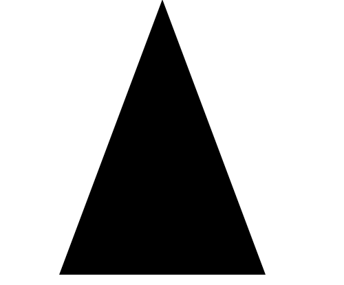
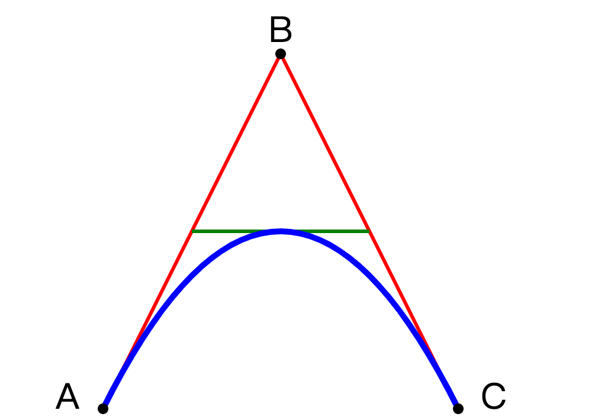

## SVG 路径 - `<path>`

`<path>` 元素用于定义一个路径。

下面的命令可用于路径数据：

- `M = moveto`
- `L = lineto`
- `H = horizontal lineto`
- `V = vertical lineto`
- `C = curveto`
- `S = smooth curveto`
- `Q = quadratic Bézier curve`
- `T = smooth quadratic Bézier curveto`
- `A = elliptical Arc`
- `Z = closepath`

**注意：**以上所有命令均允许小写字母。大写表示绝对定位，小写表示相对定位。

### 实例 1

上面的例子定义了一条路径，它开始于位置 150 0，到达位置75 200，然后从那里开始到 225 200，最后在 150 0 关闭路径。



下面是 SVG 代码：

```html
<svg xmlns="http://www.w3.org/2000/svg" version="1.1">
    <path d="M150 0 L75 200 L225 200 Z" />
</svg>
```

<button name="button" style="color: black"><a href="https://bornforthis.cn/web_runing/svg/10/10.html" target="_blank">尝试一下</a></button>

### 实例 2

下面的例子创建了一个二次方贝塞尔曲线，A 和 C 分别是起点和终点，B 是控制点：



下面是 SVG 代码：

```html
<svg xmlns="http://www.w3.org/2000/svg" version="1.1">
  <path id="lineAB" d="M 100 350 l 150 -300" stroke="red"
  stroke-width="3" fill="none" />
  <path id="lineBC" d="M 250 50 l 150 300" stroke="red"
  stroke-width="3" fill="none" />
  <path d="M 175 200 l 150 0" stroke="green" stroke-width="3"
  fill="none" />
  <path d="M 100 350 q 150 -300 300 0" stroke="blue"
  stroke-width="5" fill="none" />
  <!-- Mark relevant points -->
  <g stroke="black" stroke-width="3" fill="black">
    <circle id="pointA" cx="100" cy="350" r="3" />
    <circle id="pointB" cx="250" cy="50" r="3" />
    <circle id="pointC" cx="400" cy="350" r="3" />
  </g>
  <!-- Label the points -->
  <g font-size="30" font="sans-serif" fill="black" stroke="none"
  text-anchor="middle">
    <text x="100" y="350" dx="-30">A</text>
    <text x="250" y="50" dy="-10">B</text>
    <text x="400" y="350" dx="30">C</text>
  </g>
</svg>
```

<button name="button" style="color: black"><a href="https://bornforthis.cn/web_runing/svg/10/10-1.html" target="_blank">尝试一下</a></button>

复杂吗？是的！！由于在绘制路径时的复杂性，强烈建议使用 SVG 编辑器来创建复杂的图形。

欢迎关注我公众号：AI悦创，有更多更好玩的等你发现！

::: details 公众号：AI悦创【二维码】


:::

::: info AI悦创·编程一对一

AI悦创·推出辅导班啦，包括「Python 语言辅导班、C++ 辅导班、java 辅导班、算法/数据结构辅导班、少儿编程、pygame 游戏开发，Web，Linux」，全部都是一对一教学：一对一辅导 + 一对一答疑 + 布置作业 + 项目实践等。当然，还有线下线上摄影课程、Photoshop、Premiere 一对一教学、QQ、微信在线，随时响应！微信：Jiabcdefh

C++ 信息奥赛题解，长期更新！长期招收一对一中小学信息奥赛集训，莆田、厦门地区有机会线下上门，其他地区线上。微信：Jiabcdefh

方法一：[QQ](http://wpa.qq.com/msgrd?v=3&uin=1432803776&site=qq&menu=yes)

方法二：微信：Jiabcdefh

:::

