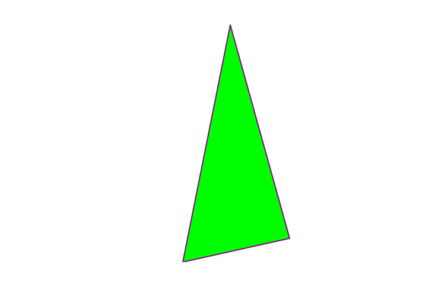
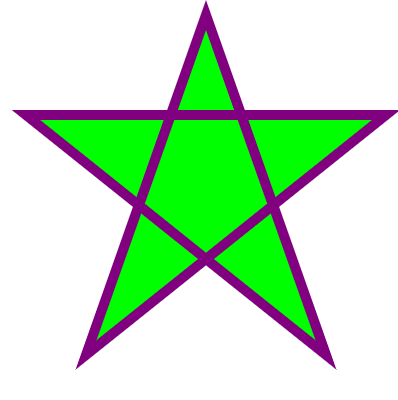
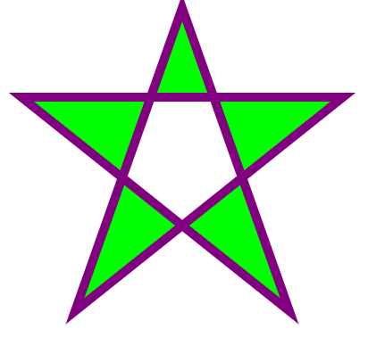

## SVG 多边形 - `<polygon>`

### 实例 1

`<polygon>` 标签用来创建含有不少于三个边的图形。

多边形是由直线组成，其形状是"封闭"的（所有的线条 连接起来）。

polygon 来自希腊。 "Poly" 意味 "many" ， "gon" 意味 "angle".



下面是 SVG 代码：

```html
<svg  height="210" width="500">
  <polygon points="200,10 250,190 160,210"
  style="fill:lime;stroke:purple;stroke-width:1"/>
</svg>
```

<button name="button" style="color: black"><a href="https://bornforthis.cn/web_runing/svg/08/08.html" target="_blank">尝试一下</a></button>

**代码解析：**

- points 属性定义多边形每个角的 x 和 y 坐标

### 实例 2

下面的示例创建一个四边的多边形：

下面是 SVG 代码：

```html
<svg height="250" width="500">
  <polygon points="220,10 300,210 170,250 123,234" style="fill:lime;stroke:purple;stroke-width:1" />
</svg>
```

<button name="button" style="color: black"><a href="https://bornforthis.cn/web_runing/svg/08/08-1.html" target="_blank">尝试一下</a></button>

### 实例 3

使用 `<polygon>` 元素创建一个星型:



下面是 SVG 代码：

```html
<svg height="210" width="500">
  <polygon points="100,10 40,198 190,78 10,78 160,198"
  style="fill:lime;stroke:purple;stroke-width:5;fill-rule:nonzero;" />
</svg>
```

<button name="button" style="color: black"><a href="https://bornforthis.cn/web_runing/svg/08/08-2.html" target="_blank">尝试一下</a></button>

### 实例 4

改变 fill-rule 属性为 "evenodd":



下面是 SVG 代码：

```html
<svg height="210" width="500">
  <polygon points="100,10 40,198 190,78 10,78 160,198"
  style="fill:lime;stroke:purple;stroke-width:5;fill-rule:evenodd;" />
</svg>
```

<button name="button" style="color: black"><a href="https://bornforthis.cn/web_runing/svg/08/08-3.html" target="_blank">尝试一下</a></button>

欢迎关注我公众号：AI悦创，有更多更好玩的等你发现！

::: details 公众号：AI悦创【二维码】


:::

::: info AI悦创·编程一对一

AI悦创·推出辅导班啦，包括「Python 语言辅导班、C++ 辅导班、java 辅导班、算法/数据结构辅导班、少儿编程、pygame 游戏开发，Web，Linux」，全部都是一对一教学：一对一辅导 + 一对一答疑 + 布置作业 + 项目实践等。当然，还有线下线上摄影课程、Photoshop、Premiere 一对一教学、QQ、微信在线，随时响应！微信：Jiabcdefh

C++ 信息奥赛题解，长期更新！长期招收一对一中小学信息奥赛集训，莆田、厦门地区有机会线下上门，其他地区线上。微信：Jiabcdefh

方法一：[QQ](http://wpa.qq.com/msgrd?v=3&uin=1432803776&site=qq&menu=yes)

方法二：微信：Jiabcdefh

:::

