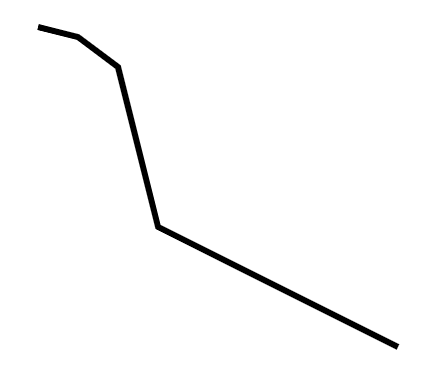
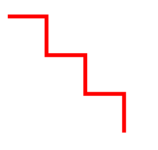

## SVG 多段线 - `<polyline>`

### 实例 1

`<polyline`> 元素是用于创建任何只有直线的形状：



下面是 SVG 代码：

```html
<svg xmlns="http://www.w3.org/2000/svg" version="1.1">
  <polyline points="20,20 40,25 60,40 80,120 120,140 200,180"
  style="fill:none;stroke:black;stroke-width:3" />
</svg>
```

<button name="button" style="color: black"><a href="https://bornforthis.cn/web_runing/svg/09/09.html" target="_blank">尝试一下</a></button>

### 实例 2

只有直线的另一个例子：



下面是 SVG 代码：

```html
<svg xmlns="http://www.w3.org/2000/svg" version="1.1">
  <polyline points="0,40 40,40 40,80 80,80 80,120 120,120 120,160" style="fill:white;stroke:red;stroke-width:4" />
</svg>
```

<button name="button" style="color: black"><a href="https://bornforthis.cn/web_runing/svg/09/09-1.html" target="_blank">尝试一下</a></button>


欢迎关注我公众号：AI悦创，有更多更好玩的等你发现！

::: details 公众号：AI悦创【二维码】


:::

::: info AI悦创·编程一对一

AI悦创·推出辅导班啦，包括「Python 语言辅导班、C++ 辅导班、java 辅导班、算法/数据结构辅导班、少儿编程、pygame 游戏开发，Web，Linux」，全部都是一对一教学：一对一辅导 + 一对一答疑 + 布置作业 + 项目实践等。当然，还有线下线上摄影课程、Photoshop、Premiere 一对一教学、QQ、微信在线，随时响应！微信：Jiabcdefh

C++ 信息奥赛题解，长期更新！长期招收一对一中小学信息奥赛集训，莆田、厦门地区有机会线下上门，其他地区线上。微信：Jiabcdefh

方法一：[QQ](http://wpa.qq.com/msgrd?v=3&uin=1432803776&site=qq&menu=yes)

方法二：微信：Jiabcdefh

:::

