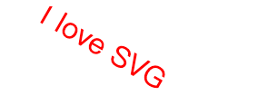
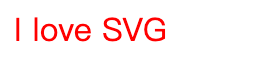

## SVG 文本 - `<text>`

`<text> ` 元素用于定义文本。

### 实例 1

写一个文本：

`I love SVG`

下面是 SVG 代码：

```html
<svg xmlns="http://www.w3.org/2000/svg" version="1.1">
  <text x="0" y="15" fill="red">I love SVG</text>
</svg>
```

<button name="button" style="color: black"><a href="https://bornforthis.cn/web_runing/svg/SVG-text/SVGtext.html" target="_blank">尝试一下</a></button>

## 实例 2

旋转的文字：



下面是 SVG 代码

```html
<svg xmlns="http://www.w3.org/2000/svg" version="1.1">
  <text x="0" y="15" fill="red" transform="rotate(30 20,40)">I love SVG</text>
</svg>
```

<button name="button" style="color: black"><a href="https://bornforthis.cn/web_runing/svg/SVG-text/SVGtext-1.html" target="_blank">尝试一下</a></button>

### 实例 3

路径上的文字：

下面是 SVG 代码：

```html
<svg xmlns="http://www.w3.org/2000/svg" version="1.1"
xmlns:xlink="http://www.w3.org/1999/xlink">
   <defs>
    <path id="path1" d="M75,20 a1,1 0 0,0 100,0" />
  </defs>
  <text x="10" y="100" style="fill:red;">
    <textPath xlink:href="#path1">I love SVG I love SVG</textPath>
  </text>
</svg>
```

<button name="button" style="color: black"><a href="https://bornforthis.cn/web_runing/svg/SVG-text/SVGtext-2.html" target="_blank">尝试一下</a></button>

### 实例 4

元素可以安排任何分小组与 `<tspan>`  元素的数量。每个 `<tspan>` 元素可以包含不同的格式和位置。几行文本(与 `<tspan>` 元素):

下面是 SVG 代码：

```html
<svg xmlns="http://www.w3.org/2000/svg" version="1.1">
  <text x="10" y="20" style="fill:red;">Several lines:
    <tspan x="10" y="45">First line</tspan>
    <tspan x="10" y="70">Second line</tspan>
  </text>
</svg>
```

<button name="button" style="color: black"><a href="https://bornforthis.cn/web_runing/svg/SVG-text/SVGtext-3.html" target="_blank">尝试一下</a></button>

## 实例 5

作为链接文本（ `<a>` 元素）：

[](https://bornforthis.cn/column/svg-tutorial/)

下面是 SVG 代码：

```html
<svg xmlns="http://www.w3.org/2000/svg" version="1.1"
xmlns:xlink="http://www.w3.org/1999/xlink">
  <a xlink:href="https://bornforthis.cn/column/svg-tutorial/" target="_blank">
    <text x="0" y="15" fill="red">I love SVG</text>
  </a>
</svg>
```

<button name="button" style="color: black"><a href="https://bornforthis.cn/web_runing/svg/SVG-text/SVGtext-4.html" target="_blank">尝试一下</a></button>

欢迎关注我公众号：AI悦创，有更多更好玩的等你发现！

::: details 公众号：AI悦创【二维码】


:::

::: info AI悦创·编程一对一

AI悦创·推出辅导班啦，包括「Python 语言辅导班、C++ 辅导班、java 辅导班、算法/数据结构辅导班、少儿编程、pygame 游戏开发，Web，Linux」，全部都是一对一教学：一对一辅导 + 一对一答疑 + 布置作业 + 项目实践等。当然，还有线下线上摄影课程、Photoshop、Premiere 一对一教学、QQ、微信在线，随时响应！微信：Jiabcdefh

C++ 信息奥赛题解，长期更新！长期招收一对一中小学信息奥赛集训，莆田、厦门地区有机会线下上门，其他地区线上。微信：Jiabcdefh

方法一：[QQ](http://wpa.qq.com/msgrd?v=3&uin=1432803776&site=qq&menu=yes)

方法二：微信：Jiabcdefh

:::

