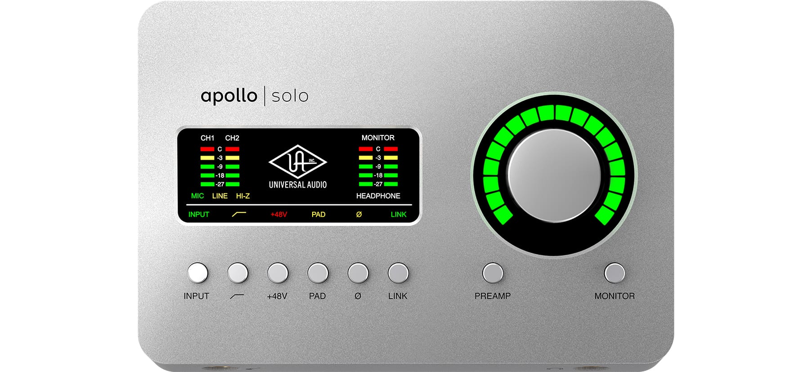
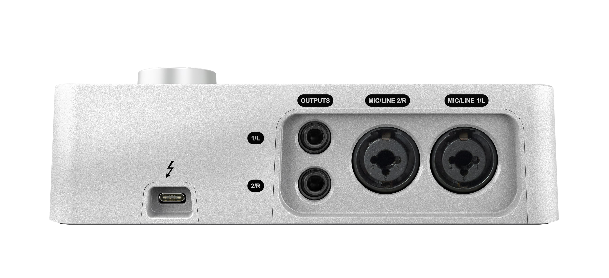

## 1. 外观

:::: tabs

@tab 1

- INPUT：输入模式选择
    - MIC
    - LINE
    - HI-Z：这个模式和 mic 模式是相互冲突的，也就是你前面吉他插入，就会自动转换，MIC 就无法使用。不过可以两个接口来解决就行。
- 低切模式：低频切除：嗡嗡声啥的
- +48：幻象电源，启动后，电容话筒的电源由它「声卡」供电，如果你用的是动圈话筒，则不需要打开；
- PAD：衰减，按下去后，你整个声音就会变小
- ∅：反转相位，按下去之后相位会被反转，一般情况下：用不到。

::: details 反转相位是什么？

"反转相位"通常用于声音和电子信号处理中。它基本上是改变信号的极性。在音频处理中，相位反转意味着将音频波形上下翻转，这会使得正变为负，负变为正。这在视觉上看起来像是音频波形反转，但其实只是振幅的改变。

在电子和电气领域，反转相位可能涉及到改变交流（AC）电源信号的方向，例如使得原来正向的电压或电流变为负向，或者反之。

理解相位反转的一个重要应用是它能够帮助消除不需要的反馈或噪声。例如，如果你有两个相同的声音信号，一个正向，一个反相，当他们同时播放时，他们会彼此抵消，结果就是听不到声音。这种原理常常被用于噪声抑制和音频处理中。

然而，必须注意的是，只有在信号完全相同且对齐时，相位反转才能实现完全抵消。在实际应用中，因为信号可能会在传播过程中发生改变，或者两个信号的开始时间可能无法完全对齐，因此并不能实现完全抵消。所以，反转相位常常被用作一种工具，用来调整或优化音频和电子系统的性能，而不是用来完全消除噪声或干扰。

**在声音上，这个功能有什么区别？**

在音频处理中，相位反转有许多重要的应用。以下是一些主要的例子：

1. 取消反馈和噪声：如果两个完全相同的声音信号，一个是正相，另一个是反相，它们会在相遇时彼此抵消，结果导致你听不到声音。这是因为他们的波峰和波谷精确地对齐，从而互相消除。这个原理可以用来减少或消除反馈和背景噪音。例如，在音乐会现场，音响工程师可能会使用这个技术来减少舞台上的反馈。

2. 立体声录音和混音：在录音和混音中，相位反转可以用来创建立体声影像的效果。例如，如果你把同一声音信号分别送到左右两个扬声器，然后把其中一个扬声器的相位反转，你会听到一种声音从中心偏离的效果。这种技术可以用来在立体声混音中创建空间感。

3. 解决相位问题：在复杂的音频系统中，由于许多不同的音频组件和信号路径，有时可能会出现相位问题。例如，两个麦克风在同一时间记录同一声音来源可能会造成相位问题。在这种情况下，相位反转可以用来解决这个问题，以确保所有的信号都可以准确地对齐和混合。

4. 麦克风阵列和扬声器设计：在设计麦克风阵列和扬声器系统时，工程师可能需要使用相位反转来优化性能。例如，麦克风阵列可能使用相位反转来聚焦在特定的声源，而避免其他的噪音。同样地，扬声器系统可能使用相位反转来改善声音的传播和扩散。

总的来说，相位反转是音频工程师和制作人员的重要工具，可以用来解决各种问题，优化音频质量，并创造特殊的声音效果。

:::

- LINK：按下去后会将1通道和2通道，强制编程立体声的通道。变成立体声道后，比较适合接一些立体声的麦克风进行录制；「比如：录制一些木吉他。

- PREAMP：切换输入界面
- MONITOR：切换输出界面
    - MONITOR：监听音箱输出
    - HEADPHONE：耳机输出

@tab 2

- 左边👈乐器输入
- 右边👉耳机的输出

@tab 3

- Output: 监听音箱
- 阿波罗的话放足够优秀，你除非买很好的，不然没必要花钱。

::::

## 2. UA Apollo声卡配置

::: tin Over

最终......基于，太复杂、太拉垮，烂尾了。建议新手买个几百块就行，淘宝的店家也不咋地，还是假货。维权难。。。

:::

欢迎关注我公众号：AI悦创，有更多更好玩的等你发现！

::: details 公众号：AI悦创【二维码】

:::

::: info AI悦创·编程一对一

AI悦创·推出辅导班啦，包括「Python 语言辅导班、C++ 辅导班、java 辅导班、算法/数据结构辅导班、少儿编程、pygame 游戏开发、Linux、Web全栈」，全部都是一对一教学：一对一辅导 + 一对一答疑 + 布置作业 + 项目实践等。当然，还有线下线上摄影课程、Photoshop、Premiere 一对一教学、QQ、微信在线，随时响应！微信：Jiabcdefh

C++ 信息奥赛题解，长期更新！长期招收一对一中小学信息奥赛集训，莆田、厦门地区有机会线下上门，其他地区线上。微信：Jiabcdefh

方法一：[QQ](http://wpa.qq.com/msgrd?v=3&uin=1432803776&site=qq&menu=yes)

方法二：微信：Jiabcdefh

:::

