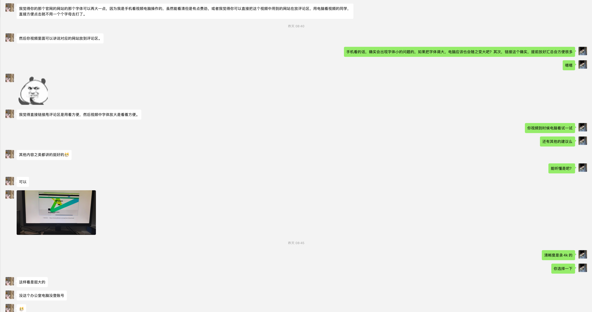
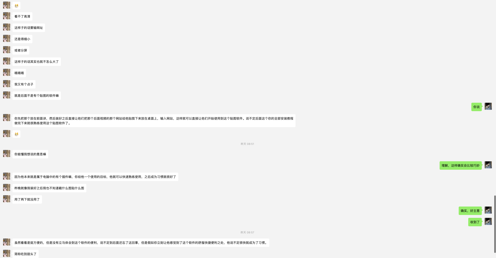

你好，我是悦创。

在这里，你将有机会直接提出你想优先学习的内容，我会视具体情况进行优先更新。

**方法：**

- 直接每期视频评论；
- 本文直接评论；
- 微信交流群；

**发布平台：**

- 视频号
- 网易云课堂
- 51CTO
- 微信公众号
- 哔哩哔哩
- YouTube
- 微博
- 知识星球

## 2023年

:::: tabs

@tab 7 月

## 1. 23～26日

::: details

- [ ] Python 环境搭建
    - [x] Win：
        - [ ] 内容：
            - [x] Python
            - [x] PyCharm
            - [x] ConEmu
            - [x] Snipaste
            - [x] Chrome
            - [x] SublimeText3
            - [ ] Git & GitHub 注册
        - [x] 录制：2023-07-26 02:31:54
        - [x] 剪辑：
            - [x] 粗剪辑「忘记。。。把开头多余的部分去掉emmmm」
            - [x] 稍微细剪辑「取出黑幕」
            - [ ] 添加字幕：考虑中。。。有点费力😓
        - [x] 完成日期📅：2023-07-27 02:03:00
- [x] 课程信息：
    - [x] 初步课程封面；
    - [x] 课程简介
        - [x] 标题：AIGC 小咖养成计划
        - [x] 课程简介：拥抱 AI 能力，成为 10 倍职场人。去除市面的碎片化，内聚你所有需要的知识和技能，持续迭代课程，保持最新～
        - [x] 适合人群：本课程适合所有零基础，面向所有内容工作者，只要你工作中有和文字、图像、视频打交道的场景，都可以学。
            - [x] 本课程适合所有零基础学生，面向所有内容工作者，只要你工作中有和文字、图像、视频打交道的场景，这么课会帮你链接 AI 能力，升级职场技能。
        - [x] 课程介绍：
            - [x] 本课程适合所有零基础学生，面向所有内容工作者，只要你工作中有和文字、图像、视频打交道的场景，这么课会帮你链接 AI 能力，升级职场技能。"Let's enjoy a long Al summer, not rush unprepared into a fall."“让我们享受一个精彩的 Al 长夏，而不是毫无准备地冲进深秋。“

**视频简介：**

本视频是 AI悦创·AIGC未来教育系列课程中的第一节视频：Windows 下环境 Python 环境搭建，主要涉及内容有：Chrome、Python、Pycharm「常用设置」、SublimeText3、Snipaste、ConEmu。

更新计划链接：[https://bornforthis.cn/column/video_loging/update_plan.html](https://bornforthis.cn/column/video_loging/update_plan.html)

本系列课程设计内容较多，包括但不限于：Python、数据分析、ChatGPT、AI、SD、Midjourney、思维等，如果你有想学的（包括其它），希望提前更新：请在每期视频下方文明评论，我会添加到此文章中并排列优先级。「记得点赞+关注」一键三连。

```text
#AIGC #AI画图 #ChatGPT #StableDiffusion #Midjourney #Python #编程一对一教学 #AI悦创·编程一对一 
```

**总结教训：**

- 视频结尾没有检查，黑幕太长～
- 不连续的感觉，之后要重新录制

```text
1. 如果你是内容工作者：想找创作灵感、激发更大的创造力；
2. 如果你是互联网工程师：想制作数字人、提升编程能力；
3. 如果你是学生：想搭建论文大纲、找学习资料；
4. 如果你是设计师：想体验生成式 AI，找到提效插件；
5. 如果你是职场人：想用 GPT 生成报表、网页、PPT；
6. 如果你是学生：想提升自己、完成学校 Python、人工智能、数据分析、办公自动化等，我这个系列课程都能符合你。

"Let's enjoy a long Al summer, not rush unprepared into a fall."
“让我们享受一个精彩的 Al 长夏，而不是毫无准备地冲进深秋。“

答疑：
购买课程后，可以进入课程交流群，我 AI悦创定期答疑。微信：Jiabcdefh「添加时，记得备注订单号」
```

**网友反馈：**





:::

## 2. 27~31日

::: details

- [x] Mac 环境搭建：
    - [x] Python
    - [x] PyCharm
    - [x] iterm2
    - [x] Snipaste
    - [x] Chrome
    - [x] SublimeText3
    - [ ] Git & GitHub
- [ ] SD：
    - [ ] 宣传视频
    - [ ] 安装视频
- [x] 心得：
    - [x] 很多不足的可以后期补录，但是虽然可以出片，但是还是不连续。
    - [ ] 解决方法：
        - [ ] 多睡觉，太疲劳录的效果不好，希望实现吧......
        - [ ] 提高剪辑技术
    
- [x] 录制时间：2023-07-30 16:29:32

**视频简介：**

本视频是 AI悦创·AIGC未来教育系列课程中的第二节视频：MacOS 下 Python 环境搭建，主要涉及内容有：Chrome、Python、Pycharm「常用设置」、SublimeText3、Snipaste、iTerm2。「记得点赞+关注」一键三连。

```text
#AIGC #AI画图 #ChatGPT #StableDiffusion #Midjourney #Python #编程一对一教学 #AI悦创·编程一对一 
```

:::

@tab 8 月

待开始

@tab 9 月

## 1. 9月1日～9月4日

- [x] 视频标题：03-AIGC 通用环境搭建「Git、GitHub、SSH 配置」
- [x] GitHub 注册邮箱：`20225195927@stu.sqmc.edu.cn`
- [x] SSH 配置教程
- [x] gti 安装/win/macos

```
本视频是 AI悦创·AIGC未来教育系列课程中的第三节视频：MacOS/Windows 下 Git 环境搭建，主要涉及内容有：Git 安装、GitHub 注册、SSH 配置。「记得点赞+关注」一键三连。
```


::::

## 便捷内容汇总

```text
tag: #AIGC #AI画图 #ChatGPT #StableDiffusion #Midjourney #Python #编程一对一教学 #AI悦创·编程一对一 #AI PPT制作 #Github #Git
```

## 计划更新内容

| 序号 | 名称                          | 内容                                                         | 填写日期            | 完成日期            |
| ---- | ----------------------------- | ------------------------------------------------------------ | ------------------- | ------------------- |
| 01   | 01-AIGC 环境搭建「Win」       | Windows 下环境 Python 环境搭建，主要涉及内容有：<br />1. Chrome<br />2. Python<br />3. Pycharm「常用设置」<br />4. SublimeText3<br />5. Snipaste<br />6. ConEmu | 2023-07-26 02:31:54 | 2023-07-27 02:03:00 |
| 02   | 02-AIGC 环境搭建「Mac」       | MacOS 下环境 Python 环境搭建，主要涉及内容有：<br />1. Chrome<br />2. Python<br />3. Pycharm「常用设置」<br />4. SublimeText3<br />5. Snipaste<br />6. iTerm2 | 2023-07-27 16:29:32 |                     |
| 03   | 03-AIGC 环境搭建「Win & Mac」 | 1. Git 「Mac、Win」<br />2. GitHub 注册<br />3. SSH 配置     | 2023-07-31 17:56:06 |                     |
| 04   | 04-来自魔仙堡的礼物🎁          | 1. 我的网站<br />2. 密码如何获取<br /><br />3. 有效期<br />3.1 转发视频到一个独一无二的微信群：+1月；<br />3.2 转发朋友圈（全部可见，至少存活 24h）：一期一次，每次 +7天<br />3.3 一键三连：每期视频 +7天（视频号-7、B 站-7、公众号-7）<br />3.4 评论+课程建议：+6天（3 + 3）<br />3.5 关注成为粉丝：+1个月；<br />3.6 关注每个平台都分别 +7：（小红书、B 站、视频号、公众号、）<br />3.7 小红书：点赞（+1）、收藏（+1）、评论（+2）（每一篇都算）<br /> | 2023-08-10 23:29:56 |                     |
|      |                               |                                                              |                     |                     |
|      |                               |                                                              |                     |                     |
|      |                               |                                                              |                     |                     |
|      |                               |                                                              |                     |                     |
|      |                               |                                                              |                     |                     |
|      |                               |                                                              |                     |                     |
|      |                               |                                                              |                     |                     |
|      |                               |                                                              |                     |                     |

