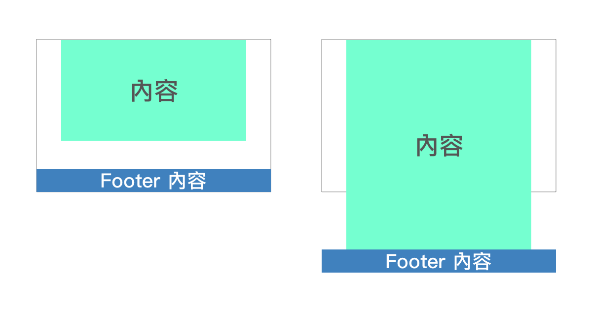

你好，我是悦创。

网页切版时 footer 需要保持置底还是随文章高度放置呢？

当内容高度过短时，若能使 footer 保持置底，文章超出浏览器高度时可以跟随高度往下跑，可使网页相对美观。

如何做到呢？以下分享了五种制作的方式。



网页切版时常会需要考虑 footer 需要保持置底还是随文章高度放置的问题，置底可以保持网页的美观，不需考虑网页内容过短时该如何处理，但若是每一页内容都很长时，则可不需要另外多做这方面的设定。

维持置底，需要注意的是并不是让他像 `position: fixed` 状态(不管滑鼠如何滚动都维持在浏览器最下面)，也不是希望他像 sticky 一样固定维持在容器内部，而是在内容少时可以沾黏在浏览器最底部，内容多时可以沾黏在内容的最底部固定在页面的最下方。

## 方法1

高度 100％，内容区块下方 margin 为负，数值跟随 footer 高度做调整。

::: tabs

@tab HTML

```html
<body>
    <div class="wrapper">
        <div class="content">
            This is the content area
        </div>
    </div>
    <footer class="footer"></footer>
</body>
```

@tab CSS

```css
html, body {
    height: 100%; /*外层高度100%*/
    margin: 0;
}
.wrapper {
    min-height: 100%; /*外层高度100%*/
    margin-bottom: -50px; /*随 footer 高度需做调整*/
}
.content{
    padding-bottom: 50px; /*避免文字超出浏览器时，内容区块不会和 footer 打架*/
}
.footer{
    height: 50px; /*设定 footer 本身高度*/
    background-color: red;
}
```

:::

## 方法2

高度100％，内容区块下方 padding 间距与 footer 高度一样， footer 下方 margin 为负。

::: tabs

@tab HTML

```html
<body>
    <div class="wrapper">
        <div class="content">
            This is the content area
        </div>
    </div>
    <footer class="footer"></footer>
</body>
```

@tab CSS

```css
html, body {
    height: 100%;
    margin: 0;
}
.wrapper {
    min-height: 100%;
}
.content {
    padding-bottom: 50px; /*随 footer 高度需做调整*/
}
.footer {
    height: 50px; /*设定 footer 本身高度*/
    margin-top: -50px; /*随 footer 高度需做调整*/
    background-color: blue;
}
```

:::

## 方法3

使用 `calc()` 计算减少内容区块高度，达到置底效果。

::: tabs

@tab HTML

```html
<body>
    <div class="wrapper">
        <div class="content">
            This is the content area
        </div>
    </div>
    <footer class="footer"></footer>
</body>
```

@tab CSS

```css
html, body {
    height: 100%;
    margin: 0;
}
.wrapper {
    min-height: calc(100% - 50px); /*減去footer高度*/
}
.footer {
    height: 50px; /*设定 footer 本身高度*/
    background-color: yellow;
}
```

:::

## 方法4

使用 flex 与 `flex-grow` 撑满 footer 以上的区块方式，达到 footer 置底。

::: tabs

@tab HTML

```html
<body>
    <div class="wrapper">
        <div class="content">
            This is the content area
        </div>
    </div>
    <footer class="footer">footer 內容 footer 內容 footer 內容 footer 內容 footer 內容 footer 內容 footer 內容</footer>
</body>
```

@tab CSS

```css
html, body {
    height: 100%;
    margin: 0;
}
body {
    display: flex; /*使物件依序排列*/
    flex-direction: column; /*使物件垂直排列*/
}
.wrapper {
    flex-grow: 1; /*可占满垂直剩余的空间*/
}
.footer {
    background-color: gray;
}
```

:::

## 方法5

使用 grid 排版方式使 footer 置底。

::: tabs

@tab HTML

```html
<body>
    <div class="wrapper">
        <div class="content">
            This is the content area
        </div>
    </div>
    <footer class="footer"></footer>
</body>
```

@tab CSS

```css
html {
    height: 100%;
}
body {
    margin: 0;
    min-height: 100%;
    display: grid; /*使用 grid 排版*/
    grid-template-rows: 1fr auto; /*将上半部设置为一个单位，剩下的部分设为自动高度*/
}
.footer {
    background-color: green;
    grid-row-start: 2;/*栏位从第二条横线开始*/
    grid-row-end: 3;/*栏位从第三条横线结束*/
}
```

:::

## 參考資料

- [https://css-tricks.com/couple-takes-sticky-footer/](https://css-tricks.com/couple-takes-sticky-footer/)

- [https://cythilya.github.io/2017/04/06/flexbox-advance/](https://cythilya.github.io/2017/04/06/flexbox-advance/)

- [https://css-tricks.com/snippets/css/complete-guide-grid/](https://css-tricks.com/snippets/css/complete-guide-grid/)

- [https://www.w3schools.com/css/css_grid_container.asp](https://www.w3schools.com/css/css_grid_container.asp)


::: details 公众号：AI悦创【二维码】


:::

::: info AI悦创·编程一对一

AI悦创·推出辅导班啦，包括「Python 语言辅导班、C++ 辅导班、java 辅导班、算法/数据结构辅导班、少儿编程、pygame 游戏开发」，全部都是一对一教学：一对一辅导 + 一对一答疑 + 布置作业 + 项目实践等。当然，还有线下线上摄影课程、Photoshop、Premiere 一对一教学、QQ、微信在线，随时响应！微信：Jiabcdefh

C++ 信息奥赛题解，长期更新！长期招收一对一中小学信息奥赛集训，莆田、厦门地区有机会线下上门，其他地区线上。微信：Jiabcdefh

方法一：[QQ](http://wpa.qq.com/msgrd?v=3&uin=1432803776&site=qq&menu=yes)

方法二：微信：Jiabcdefh

:::


