## 前端工程师

### 你的疑惑？

- 为什么选择前端开发
- 什么样的前端工程师，市场需求更抢手
- 前端工程师需要学习哪些知识
- 怎么样才能学会

## 为什么选择前端开发

### 职业前景好 

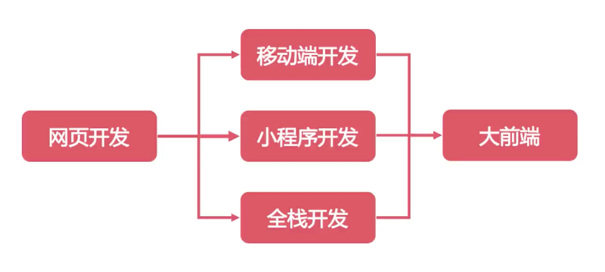

### 选择性多

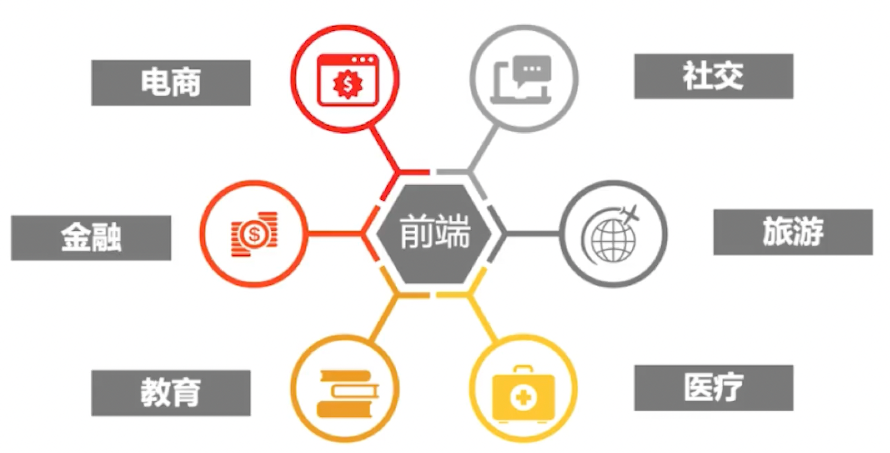

### 适合初学者

- 入门门槛低
- 容易上手

## 哪种前端工程师，市场需求更抢手？

不再只要求单一技能需求，而是多种多样的技能需求。要很多技术都要会！

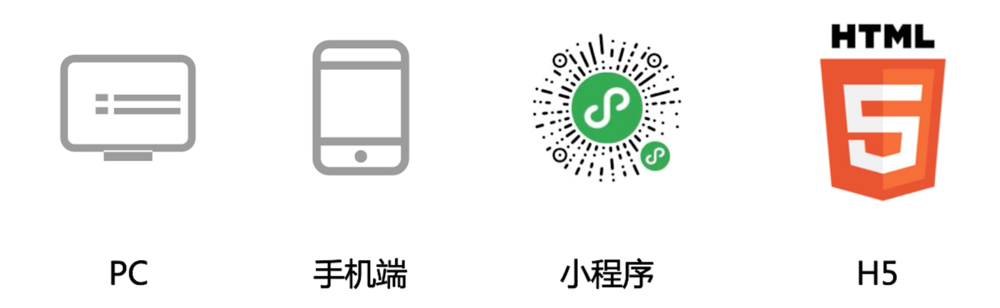

 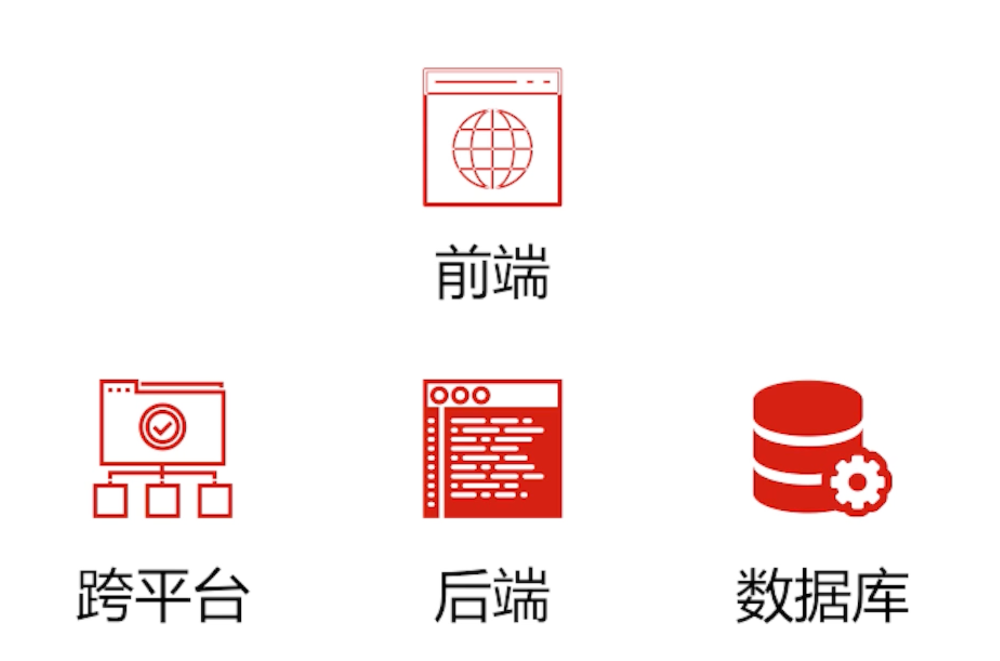

- 前端工程师
- Web 全栈工程师
- H5/小程序开发工程师
- Node.js 工程师岗位

## 多面手的前端人才，市场需求量很大？

### 前端招聘需求

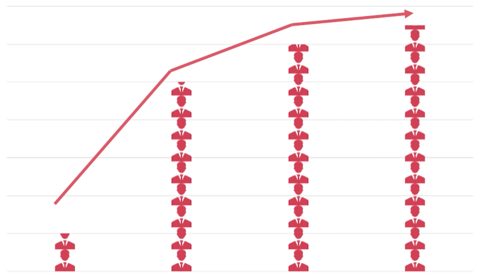

## 我将带你：从 0 到全栈能力，更具有职业竞争力的前端工程师

- 完备的知识体系，拓宽跨平台技能；
- 从前端到服务端，帮你打通全栈开发能力；
- 两大核心企业项目，贯穿整个体系，实现项目闭环开发；
- 还原企业真实开发业务场景，掌握企业项目迭代需求与流程；
- 15+ 练手项目，学习过程即实战，帮你夯实基础；
- 学练测评答一体化，为你的学习保驾护航。

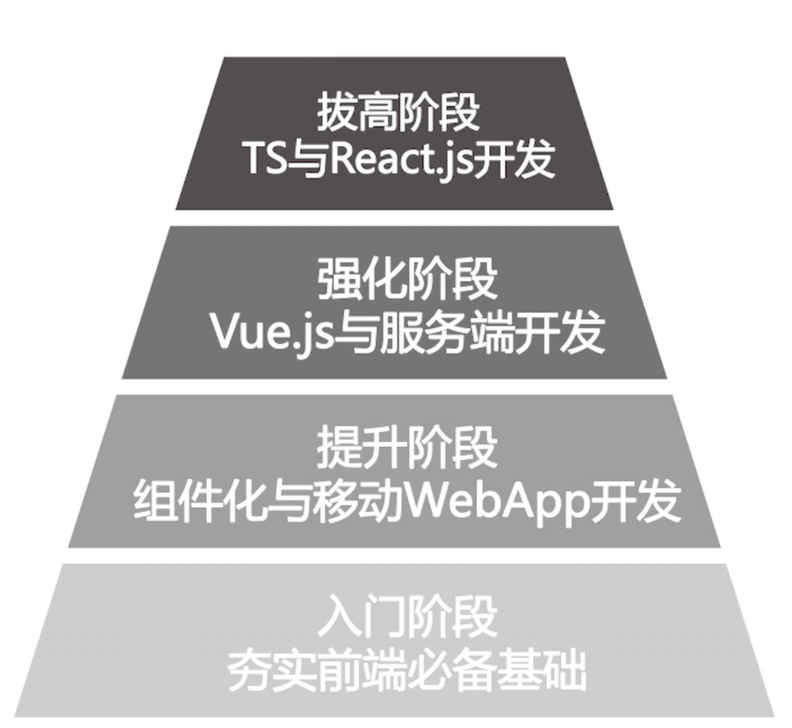

### 阶段一：零基础入门

完成第一阶段的学习，你将可以胜任网页开发工程师的工作了。

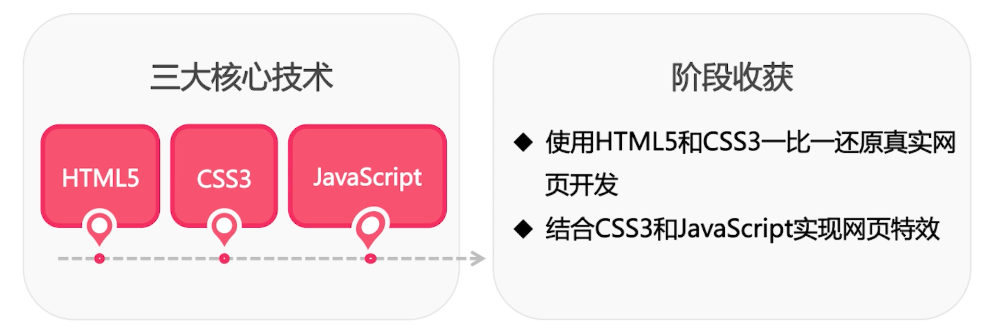 

### 阶段二：组件化与 Web APP 开发

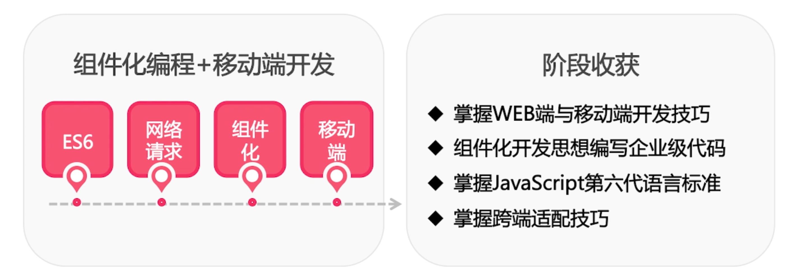

### “仿穷游”旅游网前端项目

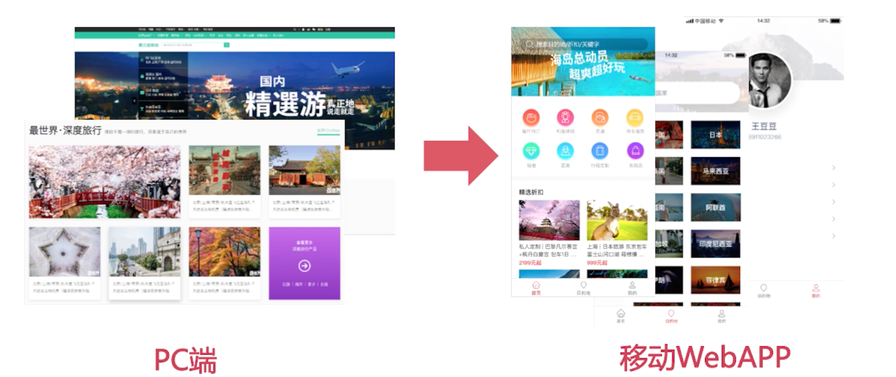

在这个项目中，你会体验到，同一项目逐步迭代，亲历体验企业开发项目。

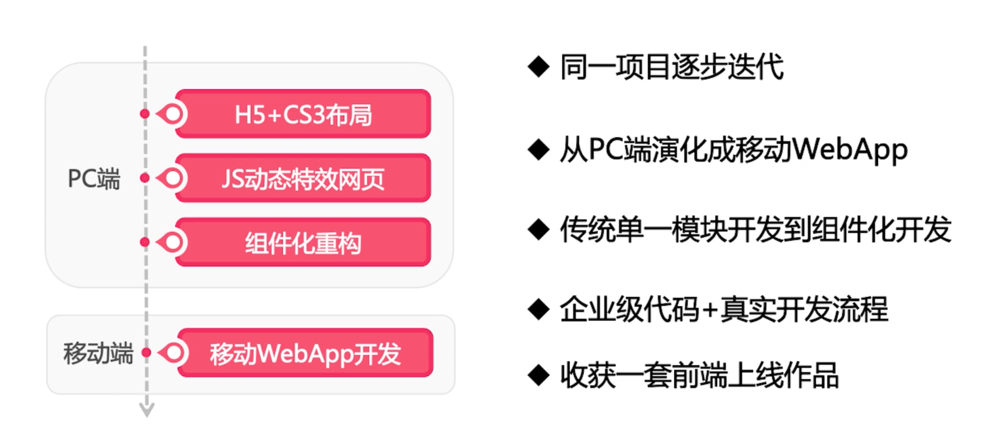

### 阶段三：主流框架与小程序

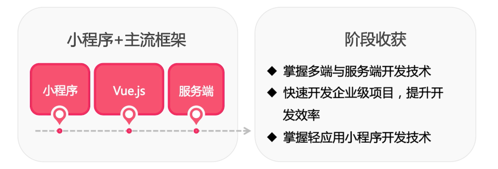

### “仿京东到家 WebAPP 全栈项目

- 六大核心业务
- 15+ 精美页面
- 12+ 真实接口
- 多套实用解决方案

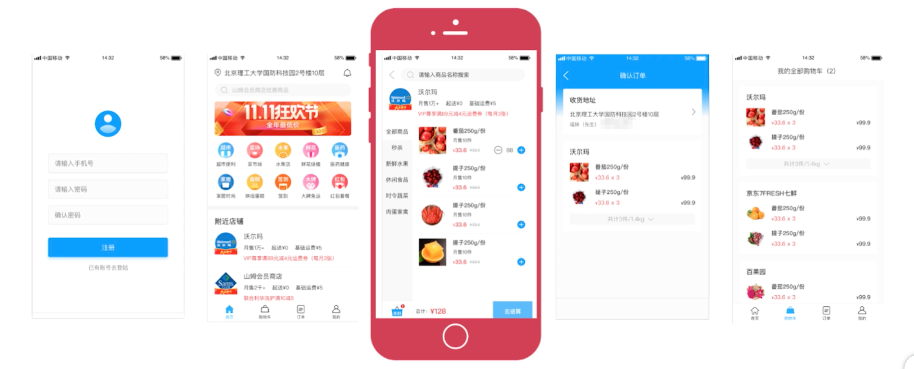

### 前后端分离的开发模式

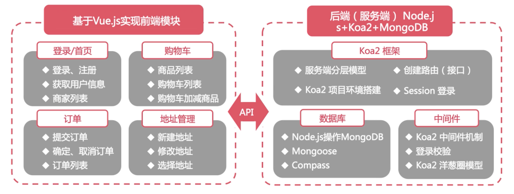

### 企业真实开发业务场景+流程

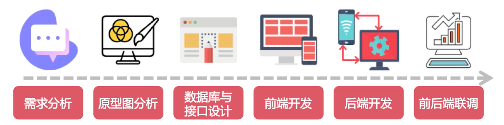

其实，学完第一到第三阶段，你已经拥有，一年的开发经验。带你就业不是目的，只是顺带的，而是要带出具有核心竞争力的人。

### 阶段四：大厂钟爱技术栈

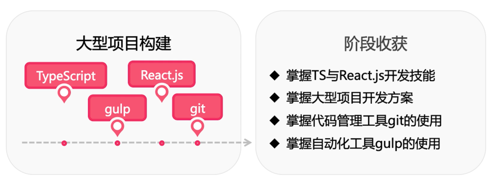

### 大型旅游项目

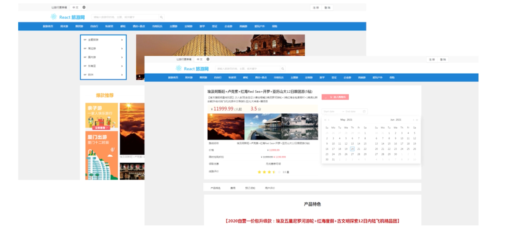

### 多样化案例驱动式教学

### 面试指导

- 前端面试高频知识梳理
    - 带你把知识串成线，连成面，印在脑中
- 独家解题方法揭秘
    - 让你实现“会1道题，就能解决一类题”
- 高效的面试技巧传授
    - 带你理清“什么事必会题，什么是加分题”
- 大厂面试+就业全流程指导
    - 带你掌握面试流程、建立制作及求职方法论

## 如何高效学习

学有所依，教有所凭，AI悦创精心研制，过万私教学员验证的教学方法。

遵循科学学习理论，AI悦创为国内外学生定制，更适合国人的教学方法。

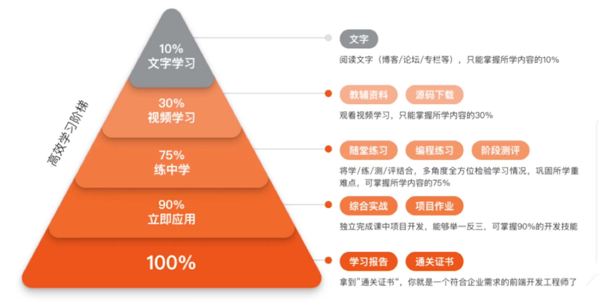

## 好的方法让你的学习事半功倍

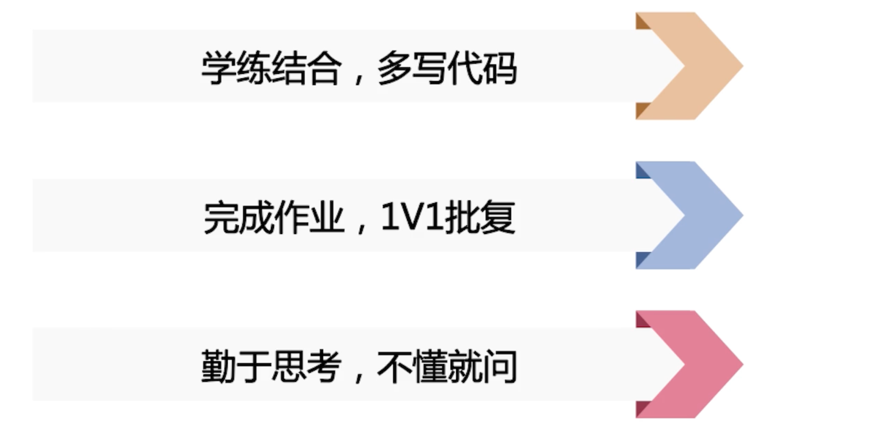

::: details 公众号：AI悦创【二维码】

:::

::: info AI悦创·编程一对一

AI悦创·推出辅导班啦，包括「Python 语言辅导班、C++ 辅导班、java 辅导班、算法/数据结构辅导班、少儿编程、pygame 游戏开发」，全部都是一对一教学：一对一辅导 + 一对一答疑 + 布置作业 + 项目实践等。当然，还有线下线上摄影课程、Photoshop、Premiere 一对一教学、QQ、微信在线，随时响应！微信：Jiabcdefh

C++ 信息奥赛题解，长期更新！长期招收一对一中小学信息奥赛集训，莆田、厦门地区有机会线下上门，其他地区线上。微信：Jiabcdefh

方法一：[QQ](http://wpa.qq.com/msgrd?v=3&uin=1432803776&site=qq&menu=yes)

方法二：微信：Jiabcdefh

:::

