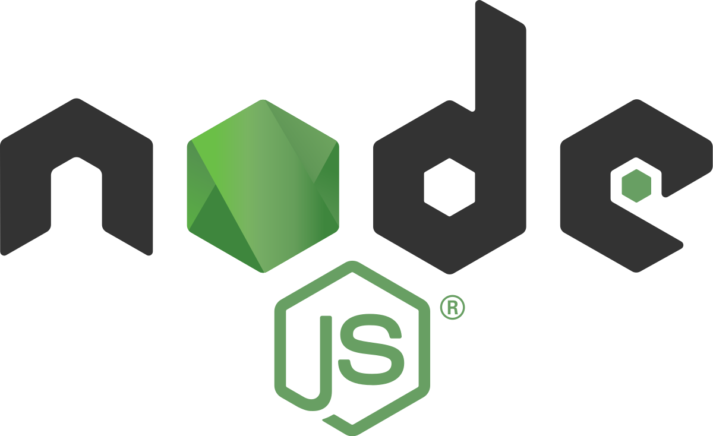
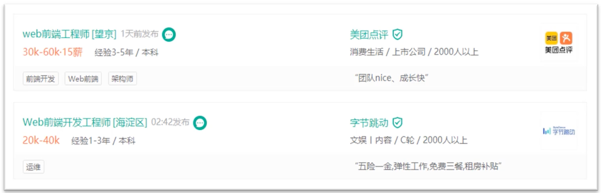

## 前端开发行业介绍 

- 前端开发的前身是 “**网页制作**” ，随着 **移动端的兴起和 4G、5G 技术的普及**，互联网产品业务月来越复杂，在 2011 年前后，逐步蜕变为前端开发。「在 2011年之前，实际上前端和后端是基本上不分家的。但是在 2011年之后，智能手机开始普及，大家的智能手机也基本上是 2011年前后买的。」
- 什么是“前端”：一切用户能够看见的东西、产生交互的东西，都是前端同学在负责。
- 后端： 负责数据、数据库等，增删改查等操作。

## 前端开发变革

- 2016 年前后，前端开发突然迎来了 **技术井喷期**，开发形式突然 **发生了翻天覆地的变化**。

Nodejs 05年就诞生了，但是 15、16年才火起来的。

- 2016 年前后，以 webpack 为代表的 **Node.js 工作流工具** 使前端的开发形式 **产生了翻天覆地的变化**。「关于什么是 nodejs、webpack 大家不用着急，咱们以后都会说到。」
- 并且，随着 vue.js/React.js 诞生，使前端开发进入了 **框架的时代**。

## 大前端时代

- 今天，前端开发 ”上天入地，无所不能“：web 开发、移动 web 开发、App 开发、小程序开发、服务端开发等等；
- 一个优秀的前端开发工程师会的也很多，会被叫做：“全栈开发工程师” ，这个时代也被叫做 “大前端时代”。

::: details 公众号：AI悦创【二维码】

:::

::: info AI悦创·编程一对一

AI悦创·推出辅导班啦，包括「Python 语言辅导班、C++ 辅导班、java 辅导班、算法/数据结构辅导班、少儿编程、pygame 游戏开发」，全部都是一对一教学：一对一辅导 + 一对一答疑 + 布置作业 + 项目实践等。当然，还有线下线上摄影课程、Photoshop、Premiere 一对一教学、QQ、微信在线，随时响应！微信：Jiabcdefh

C++ 信息奥赛题解，长期更新！长期招收一对一中小学信息奥赛集训，莆田、厦门地区有机会线下上门，其他地区线上。微信：Jiabcdefh

方法一：[QQ](http://wpa.qq.com/msgrd?v=3&uin=1432803776&site=qq&menu=yes)

方法二：微信：Jiabcdefh

:::

