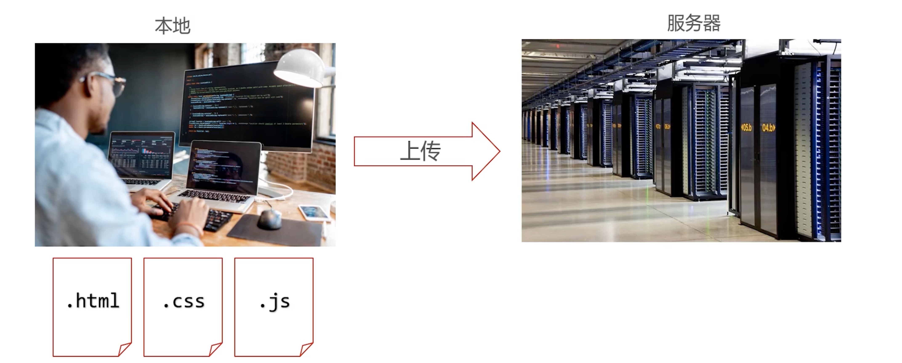
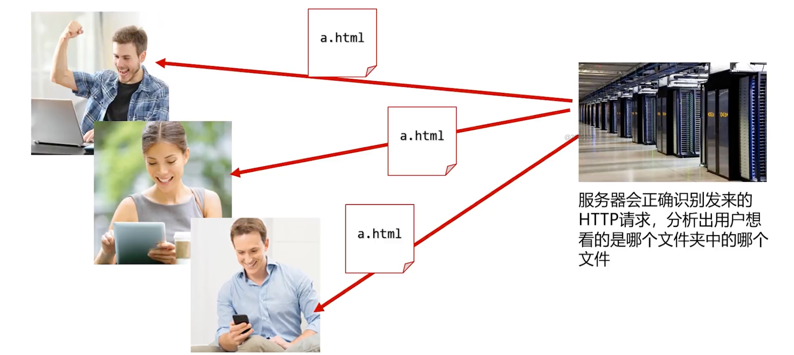
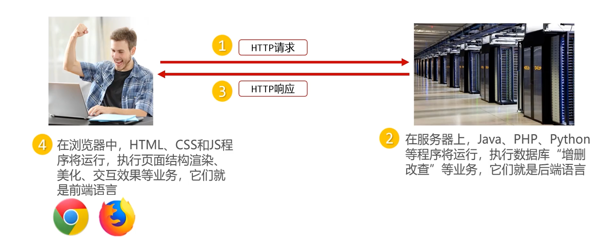
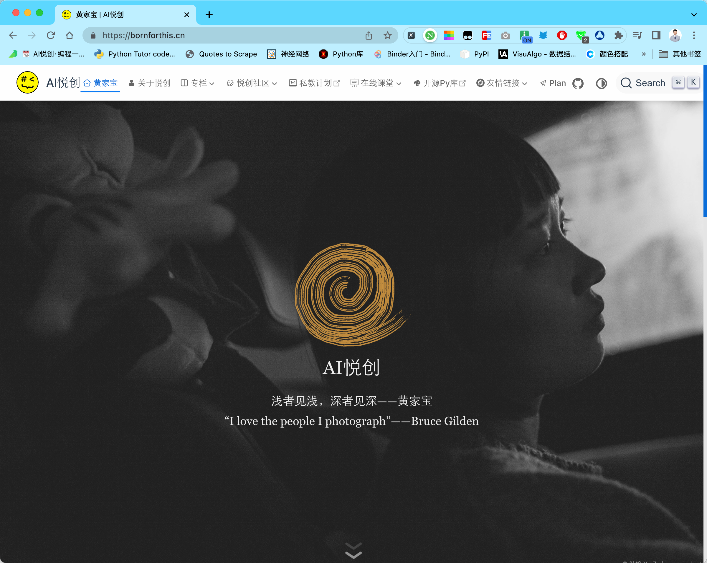
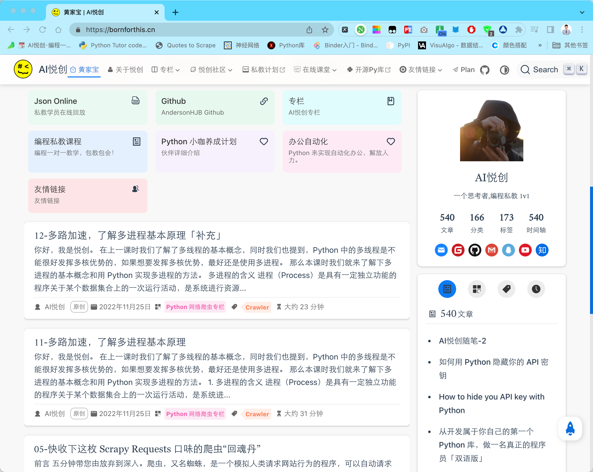

## 1. 在本地开发，在服务器共享

这是什么意思呢？

这是说，我们程序员开发网站都是在自己电脑上开发的，我们管这样的环境称为本地。也就是，我们所有的开发操作都是在本地上完成的。

我们开发的 `.html` 、`.css` 、`.js` 等文件，是需要上传到服务器后，才能被用户看见的。

服务器在上方的右边，这是一个服务器的机群，服务器实际上就是“性能”非常高的——计算机，这些计算机 24h 不断电。因为，一旦断电别的用户就不能看见我们做好的网页了。

**我们的开发人员，就是在本地将 HTML、CSS、Js，把这些开发好，上传这些文件到服务器当中，那服务器中就存储了这些文件。为什么要把文件上传到服务器？——因为，服务器有共享文件的能力。**

::: tip

比如将 `bornforthis.html` 文件传输到慕课网服务器的 b 文件夹中，此时这个文件就拥有了网址：`https://bornforthis.cn/b/bornforthis.html` 所有用户都可以访问这个网址，看见我们做的网页啦。

:::

我们要更新或者修改网站，你也只需本地修改再上传覆盖等都可以。

## 2. HTTP 协议

我们刚刚说，做好的程序或者网页，都会存储到服务器上，那么用户可能会用：笔记本电脑、iPad、手机等来访问我们的网页。

**那么，用户是怎么访问网页的呢？**

相信大家会有类似的经历，其实就是输入网址，也有可能扫描二维码进入网站。——那输入网址就是 **HTTP 请求** 。那什么是 HTTP 请求呢？我们一会给你一个定义。

服务器会正确识别发来的 HTTP 请求，分析出用户想看的是哪个文件夹中的哪个文件。然后返回给用户所请求的网页：

这样的我们称为 **HTTP 响应** 。

[03-从输入 url 到页面展现发生了什么？](https://bornforthis.cn/column/crawler/replenish03.html)

- HTTP 协议（Hypertext Transfer Protocol，超文本传输协议）是互联网数据传输的常见协议。
- 一次 HTTP 事务由“HTTP 请求” 和 “HTTP 响应” 构成的。
- 网址前的 `http://` 就表示用 http 协议请求页面

## 3. 什么是前端、后端？

举个例子：

你现在看见的是我的个人网站，那这个网站要被用户看见，要前端开发工程师和后端开发工程师共同配合的结果。——这是什么意思呢？

这个网站的文章、标题、分类数据、数量等是这些数据，实际上是从数据库中检索而来的。然后把数据给前端，前端来进行渲染搭建。

::: details 公众号：AI悦创【二维码】

:::

::: info AI悦创·编程一对一

AI悦创·推出辅导班啦，包括「Python 语言辅导班、C++ 辅导班、java 辅导班、算法/数据结构辅导班、少儿编程、pygame 游戏开发」，全部都是一对一教学：一对一辅导 + 一对一答疑 + 布置作业 + 项目实践等。当然，还有线下线上摄影课程、Photoshop、Premiere 一对一教学、QQ、微信在线，随时响应！微信：Jiabcdefh

C++ 信息奥赛题解，长期更新！长期招收一对一中小学信息奥赛集训，莆田、厦门地区有机会线下上门，其他地区线上。微信：Jiabcdefh

方法一：[QQ](http://wpa.qq.com/msgrd?v=3&uin=1432803776&site=qq&menu=yes)

方法二：微信：Jiabcdefh

:::

