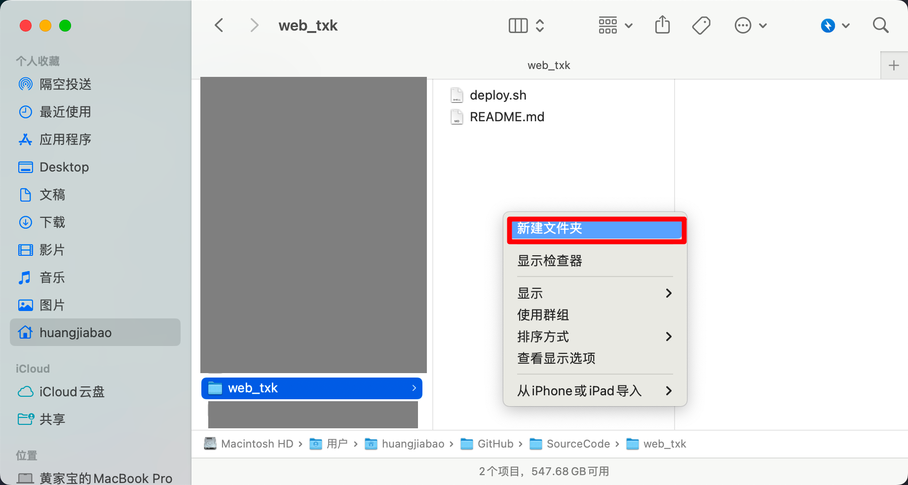
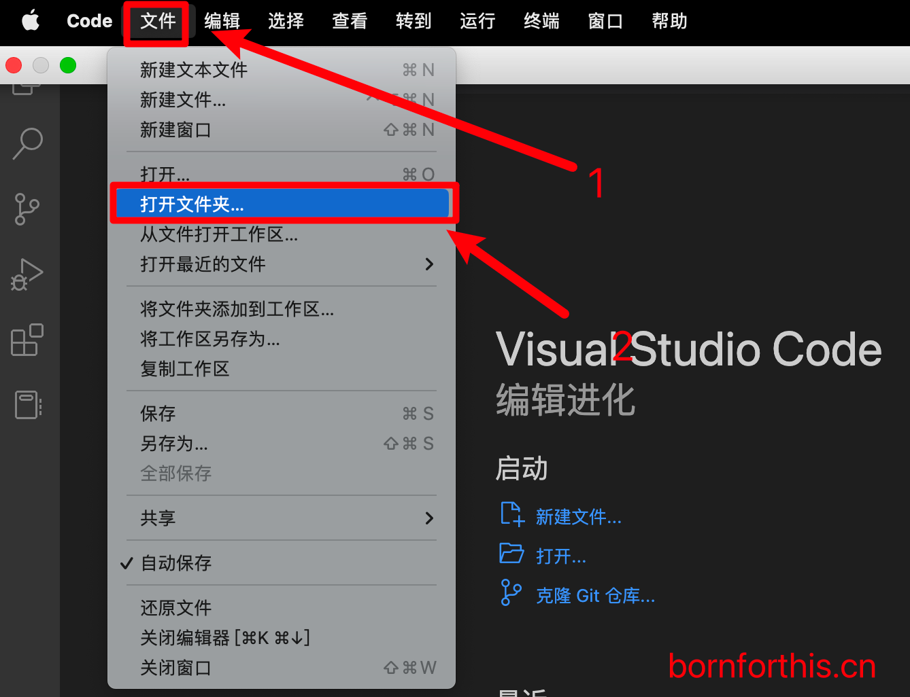
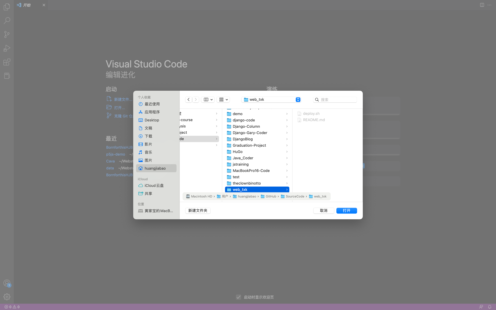
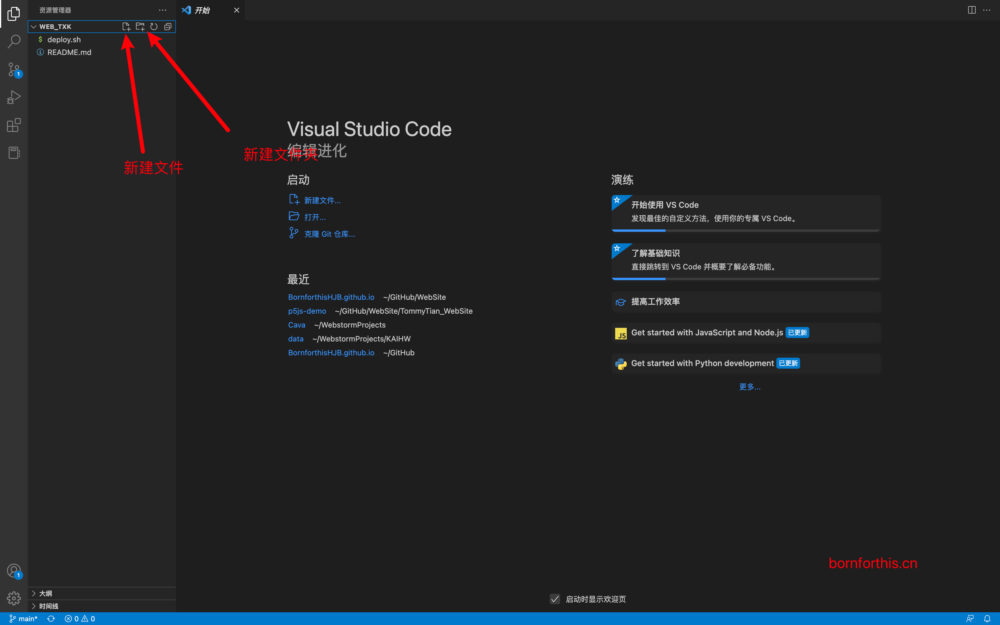
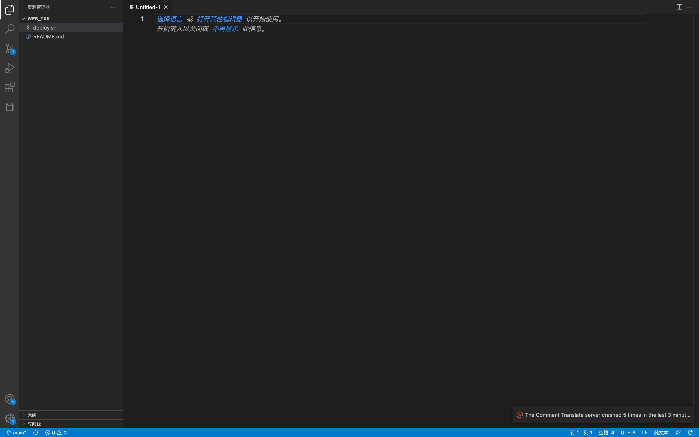
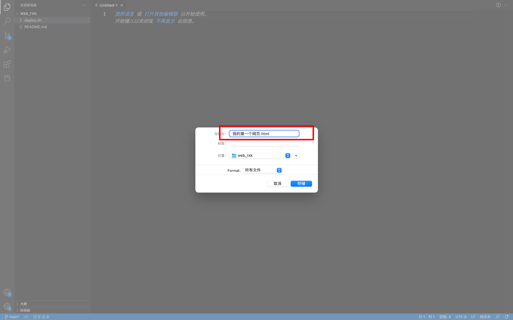
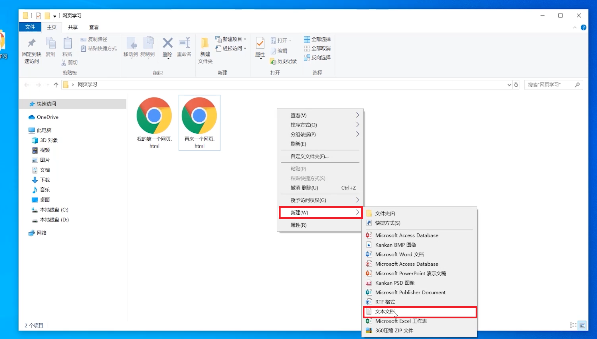
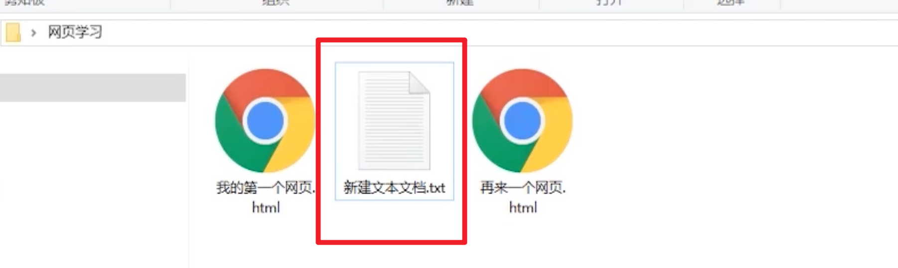
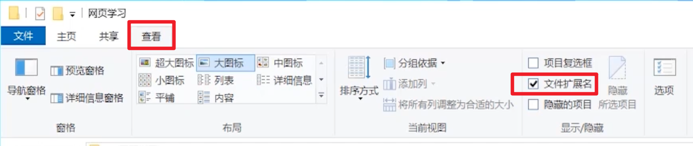
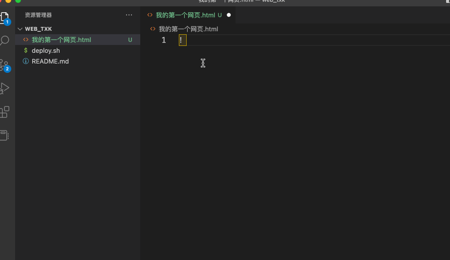

## 1. 创建第一个网页

### 1.1 创建网页-方法一

- 创建一个空文件夹，在 VScode 编辑器中打开这个文件夹
- 按 ctrl + N 快捷键新建文件，**保存格式必须要手动填写 "`.html`" 后缀**

#### 1.1.1 跟我操作

在你要存储网页的路径下，新建文件夹。新建文件夹我一般喜欢用快捷键。

- Windows：ctrl + shift + N
- MacOS：Command + shift + N
- Linux：mkdir 文件夹名称

当然，也可以快捷键 `Command + N` ：

`Command + S`：

### 1.2 创建网页-方法二

不通过 VSCode 直接，鼠标右键，新建文本文件即可。

- 在文件夹中直接点击鼠标右键“新建文本文件”
- 将 `.txt` 格式文件改为 `.html` 文件

- 必须设置操作系统“文件扩展名”为可见

::: tip 提示

其它操作系统，想要显示后缀，操作略有不同，实在不会的可以留言。

:::

接下来就可以给这个文件重命名就可以了。

## 2. HTML 文件是纯文本的

- 网页虽然是花花绿绿的，但是 html 文件本身是纯文本的

## 3. HTML 骨架的生成

- **输入!（英文模式下，输入的感叹号），按 tab 键， ** 即可自动生成 HTML 的骨架
- 如果骨架没有生成，就说明你没有将网页保存，或者网页保存格式不是 `.html` 后缀

::: tip 注意⚠️

记得保存！！！快捷键：

Mac：Command + S

Windows：Control + S

:::

::: details 公众号：AI悦创【二维码】

:::

::: info AI悦创·编程一对一

AI悦创·推出辅导班啦，包括「Python 语言辅导班、C++ 辅导班、java 辅导班、算法/数据结构辅导班、少儿编程、pygame 游戏开发」，全部都是一对一教学：一对一辅导 + 一对一答疑 + 布置作业 + 项目实践等。当然，还有线下线上摄影课程、Photoshop、Premiere 一对一教学、QQ、微信在线，随时响应！微信：Jiabcdefh

C++ 信息奥赛题解，长期更新！长期招收一对一中小学信息奥赛集训，莆田、厦门地区有机会线下上门，其他地区线上。微信：Jiabcdefh

方法一：[QQ](http://wpa.qq.com/msgrd?v=3&uin=1432803776&site=qq&menu=yes)

方法二：微信：Jiabcdefh

:::

