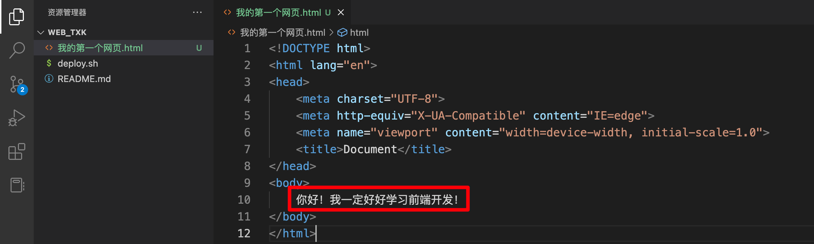
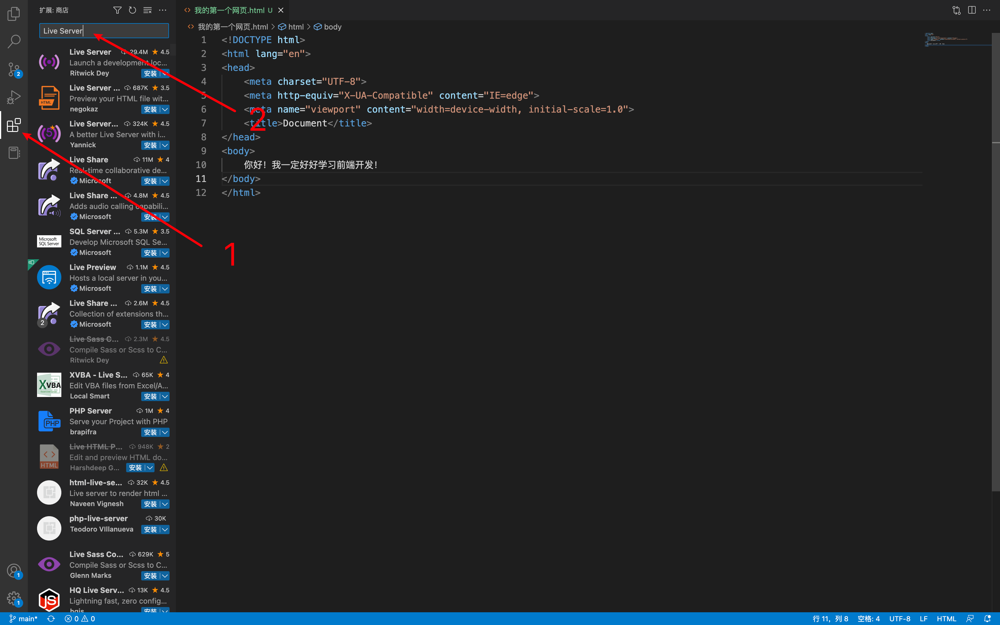
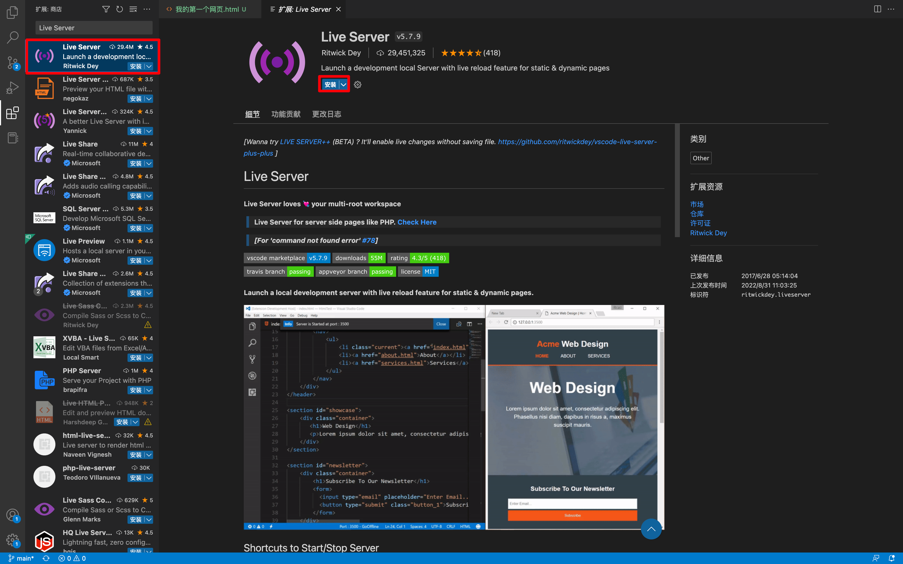
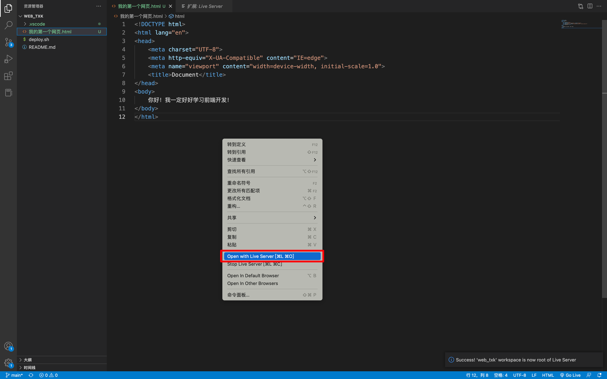
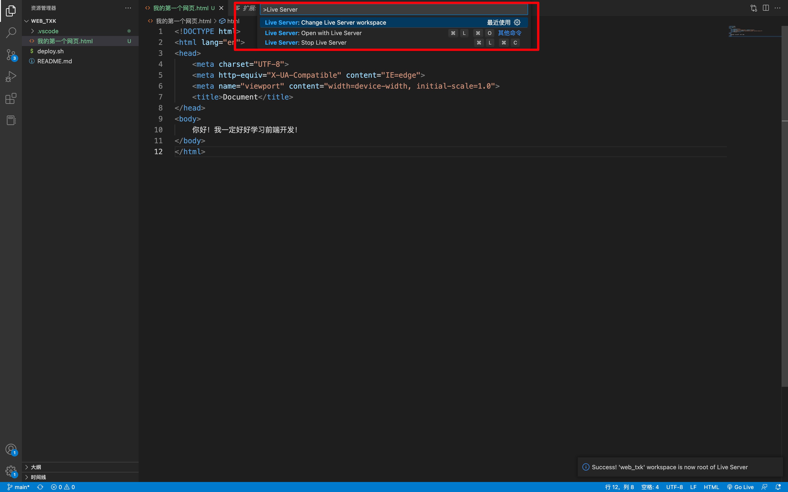

## 1. 浏览网页的方法

你好，我是悦创。

上一节课，我们学习了，如何快速的创建一个简单的 HTML 文件，但是我们要怎么浏览或者准确来说，怎么运行呢？

## 2. 网页的浏览-方法一

- 直接在文件夹中双击网页图标，即可查看网页。
- Chrome 浏览器非常适合开发， **所以要将 Chrome 浏览器设置为默认的浏览器** ，杀毒软件、管家通常会阻止这个操作，请妥善设置杀毒软件的相关设置。

现在打开如下图，空白页面：


我们如果要让其中存在内容，例如文字。那我们就需要在 VSCode 中进行编辑。

```html
<!DOCTYPE html>
<html lang="en">
<head>
    <meta charset="UTF-8">
    <meta http-equiv="X-UA-Compatible" content="IE=edge">
    <meta name="viewport" content="width=device-width, initial-scale=1.0">
    <title>Document</title>
</head>
<body>
    你好！我一定好好学习前端开发！
</body>
</html>
```



效果如下：「记得刷新页面」


## 3. 网页的浏览-方法二

- 给 VSCode 安装 Live Server 插件，顾名思义，这个插件可以让网页“实时热更新”，自动刷新网页。
- 安装完插件后，在 html 文件中，按 ctrl + shift + p 键，选择 “Open With Live Server” 即可。
- 使用这种方法必须注意：网页必须存放在文件夹中，且 VSCode 已经打开这个文件夹。





安装完成后，两种运行方式：

- 方法一：鼠标右键，选择 Live Server 进行运行
- 方法二：也可以使用 Ctrl + Shift + P，输入 Live Server 也可以。

::: tabs

@tab 方法一



@tab 方法二



:::

::: tip 提示

接下来，你随意修改，看看浏览器会不会更新吧，GO！

这个插件，你必须！打开文件夹，不能只是打开一个 HTML 文件。

:::


::: details 公众号：AI悦创【二维码】


:::

::: info AI悦创·编程一对一

AI悦创·推出辅导班啦，包括「Python 语言辅导班、C++ 辅导班、java 辅导班、算法/数据结构辅导班、少儿编程、pygame 游戏开发、Linux、Web」，全部都是一对一教学：一对一辅导 + 一对一答疑 + 布置作业 + 项目实践等。当然，还有线下线上摄影课程、Photoshop、Premiere 一对一教学、QQ、微信在线，随时响应！微信：Jiabcdefh

C++ 信息奥赛题解，长期更新！长期招收一对一中小学信息奥赛集训，莆田、厦门地区有机会线下上门，其他地区线上。微信：Jiabcdefh

方法一：[QQ](http://wpa.qq.com/msgrd?v=3&uin=1432803776&site=qq&menu=yes)

方法二：微信：Jiabcdefh

:::


