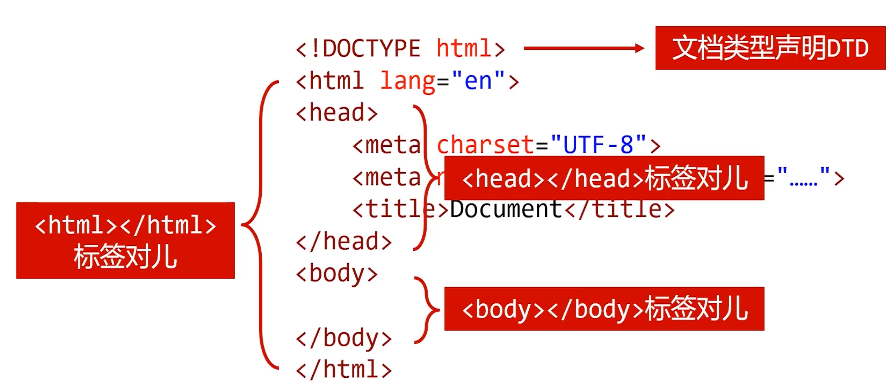
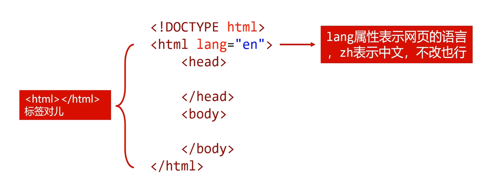
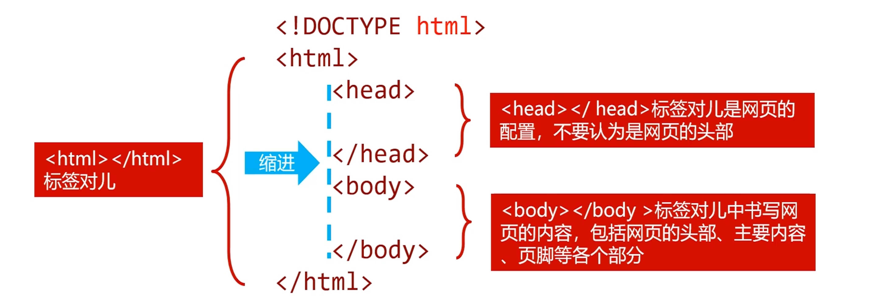
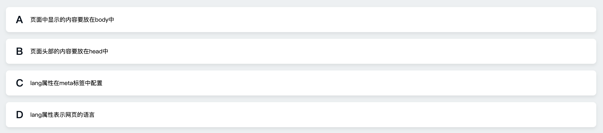
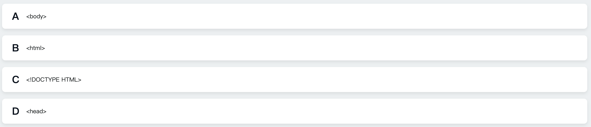
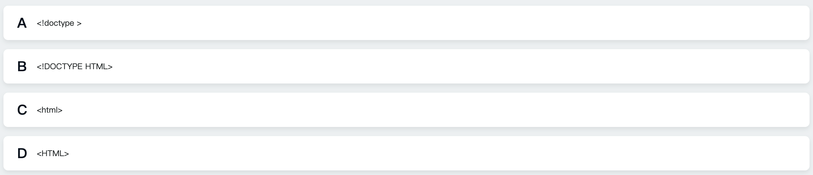

## 1. 认识 HTML5 骨架

你好，我是悦创。

在前面的课程中，我已经告诉你，使用 `!`  就可以快速生成 HTML5 的骨架。

```html
<!DOCTYPE html>
<html lang="en">
<head>
    <meta charset="UTF-8">
    <meta http-equiv="X-UA-Compatible" content="IE=edge">
    <meta name="viewport" content="width=device-width, initial-scale=1.0">
    <title>Document</title>
</head>
<body>
    
</body>
</html>
```

那么这节课，我将带你好好认识一下 HTML5 的骨架。

- `<!DOCTYPE html>` ：文档类型声明 DTD
- `<head></head>`：网页的配置



- HTML 文件第一行必须是 DTD（Document Type Definition，文档类型声明）
- 不写 DTD 会引发浏览器的一些兼容问题
- 不同版本的 HTML 有不同的 DTD 写法

例如：

- HTML5：`<!DOCTYPE html>`
- HTML4.01严格版：`<!DOCTYPE html PUBLIC "-//W3C//DTD HTML 4.01//EN" "http://www.w3.org/TR/html4/strict.dtd">`
- HTML4.01过渡版：`<!DOCTYPE html PUBLIC "-//W3C//DTD HTML 4.01 Transitional//EN" "http://www.w3.org/TR/html4/loose.dtd">`
- HTML4.01框架版：`<!DOCTYPE html PUBLIC "-//W3C//DTD HTML 4.01 Frameset//EN" "http://www.w3.org/TR/html4/frameset.dtd">`

## 2. W3C 组织

- W3C（The World Wide Web Consortium，万维网联合会）是万维万的主要国际标准组织。该联盟成立于 1994年，负责制定 Web 标准，主要是 HTML 和 CSS。


## 3. 认识 `<html>` 标签对



- 什么时候需要修改 lang 呢？——除非你公司有需要多语言版本的时候，你公司的运维工程师会把这个地方，进行相对应地修改。

## 4. 认识 `<head>` 和 `<body>` 标签对



## 5. 多选题

以下说法中，错误的是？（选择两项）



::: details 答案

正确答案： B,C 你的答案： B,C

参考解析：

本题考查 html 文档的基本结构与配置。

页面中显示的内容要放在 body 中，A说法正确。

Head 中存放的是页面的一些配置，网页中显示的内容，不管是头部，主体还是尾部，都要放在 body 中，B 说法错误。

lang 属性在 html 标签中配置，如 `<html>` ，C 说法错误。

lang 是英文单词 language（语言）的简写，所以表示网页中的语言，D 说法正确。

所以本题答案为 BC。

:::

## 6. 单选题

下面不属于 HTML 标签的是？（选择一项）



::: details 答案

正确答案： C 你的答案： C

参考解析：

本题考查 html 页面结构。

`<html><body><head>` 标签是 html 文档结构标签，`<!DOCTYPE HTML>` 不属于 html 标签，它用于定义文档类型，所以本题答案为 C。

:::

## 7. 单选题

下列代码，能正确定义文档类型的是？（选择一项）



::: details 答案

正确答案： B 你的答案： B

参考解析：

本题考查的是定义文档类型的正确写法。

`<html>` 是HTML标签，定义文档类型代码是 `<!DOCTYPE HTML>` 。

所以本题答案为 B。

:::

::: details 公众号：AI悦创【二维码】


:::

::: info AI悦创·编程一对一

AI悦创·推出辅导班啦，包括「Python 语言辅导班、C++ 辅导班、java 辅导班、算法/数据结构辅导班、少儿编程、pygame 游戏开发、Linux、Web」，全部都是一对一教学：一对一辅导 + 一对一答疑 + 布置作业 + 项目实践等。当然，还有线下线上摄影课程、Photoshop、Premiere 一对一教学、QQ、微信在线，随时响应！微信：Jiabcdefh

C++ 信息奥赛题解，长期更新！长期招收一对一中小学信息奥赛集训，莆田、厦门地区有机会线下上门，其他地区线上。微信：Jiabcdefh

方法一：[QQ](http://wpa.qq.com/msgrd?v=3&uin=1432803776&site=qq&menu=yes)

方法二：微信：Jiabcdefh

:::


