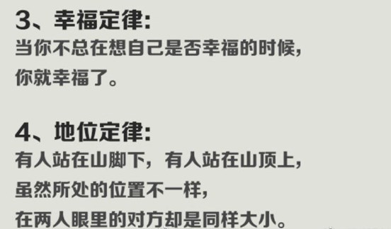
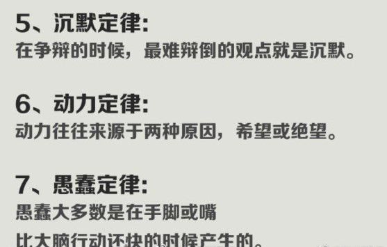
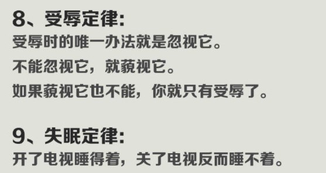
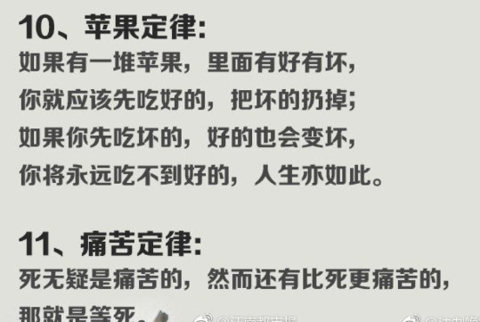
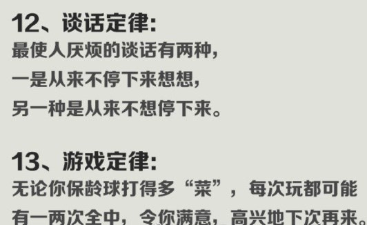
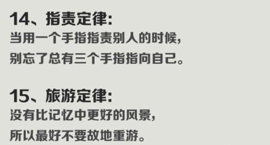

1、价值定律： 当你拥有某一样东西的时候， 你就会发现¿种东西并不像你原来所 那样有价值。 

2、 合作定律： 一个人花一个小时可以做好的事情， 两个人就要两个小时。

3、幸福定律：当你不总在想自己是否幸福的时候，你就幸福了。

4、地位定律：有人站在山脚下，有人站在山顶上，虽然所处的位置不一样，在两人眼里的对方却是同样大小。

5、沉默定律：在争辩的时候，最难辩倒的观点就是沉默。

6、动力定律：动力往往来源于两种原因，希望或绝望。

7、愚蠢定律：愚蠢大多数是在手脚或嘴，比大脑行动还快的时候产生的。

8、 受辱定律： 受辱时的唯一办法就是忽视它。 不能忽视它， 就藐视它。 如果藐视它也不能， 你就只有受辱了。 

9、 失眠定律： 开了电视睡得着， 关了电视反而睡不着。

10、苹果定律：如果有一堆苹果，里面有好有坏，你就应该先吃好的，把坏的扔掉；如果你先吃坏的，好的也会变坏，你将永远吃不到好的，人生亦如此。

11、痛苦定律：死无疑是痛苦的，然而还有比死更痛苦的，那就是等死。

12、谈话定律：最使人厌烦的谈话有两种，一是从来不停下来想想，另一种是从来不想停下来。

13、游戏定律：无论你保龄球打的多“菜”，每次玩都可能有一两次全中，令你满意，高兴地下次再来。

14、 指责定律： 当用一个手指指责别人的时候， 别忘了总有三个手指指向自己。 

15、 旅游定律： 没有比记忆中更好的风景， 所以最好不要故地重游。

